# 🌍 Buckminster Fuller Knowledge Graph
## Repository Overview

![[ascii_logo]]

> "You never change things by fighting the existing reality. To change something, build a new model that makes the existing model obsolete."

---

## 🌟 The Fuller Vision

> "We are called to be architects of the future, not its victims."

### Transformative Ideas
- [[Spaceship_Earth|Spaceship Earth]] - Our shared planetary home
- [[Comprehensive_Anticipatory_Design_Science|Design Science Revolution]]
- [[World_Game|World Game]] - Making the world work for 100% of humanity

![[fuller_quote_1]]

---

## 💫 Why This Matters Now

### Global Challenges
- Climate crisis
- Resource distribution
- Technological acceleration

### Fuller's Relevance
- [[Anticipatory_Design|Anticipatory Design]] thinking
- [[Systems_Thinking|Whole Systems Approach]]
- [[Ephemeralization|Doing More with Less]]

---

## 🧮 Mathematical Foundations

### [[Synergetics|Synergetic Geometry]]
```ascii
    /\
   /  \
  /____\
```
- [[Vector_Equilibrium|Vector Equilibrium]]
- [[Jitterbug_Transformation|Jitterbug Transform]]
- [[Closest_Packing_of_Spheres|Closest Packing]]

### [[Geodesic_Mathematics|Geodesic Math]]
- [[Great_Circle|Great Circles]]
- [[Frequency_Multiplication|Frequency]]
- [[Spherical_Trigonometry|Spherical Trig]]

---

## ⚡ Energy & Structure

### [[Tensegrity|Tensegrity Principles]]
```ascii
   ╱│╲
  ╱ │ ╲
 ╱  │  ╲
╱___│___╲
    │
```
- [[Discontinuous_Compression|Discontinuous Compression]]
- [[Continuous_Tension|Continuous Tension]]
- [[Structural_Efficiency|Maximum Efficiency]]

---

## 🏗️ Architectural Innovations

### [[Dymaxion|Dymaxion Systems]]
- [[Dymaxion_House|Autonomous Dwelling Machine]]
- [[Dymaxion_Car|Omni-Medium Transport]]
- [[Dymaxion_Map|Fuller Projection]]

### [[Geodesic_Dome|Geodesic Structures]]
- [[Dome_Mathematics|Mathematical Principles]]
- [[Dome_Construction|Construction Methods]]
- [[Montreal_Biosphere|Notable Examples]]

---

## 🧬 System Patterns

```mermaid
graph TD
    A[Nature's Patterns] --> B[Mathematics]
    A --> C[Structure]
    A --> D[Energy]
    
    B --> E[[[Vector_Mathematics|Vectors]]]
    B --> F[[[Geometry|Geometry]]]
    
    C --> G[[[Tensegrity|Tension]]]
    C --> H[[[Compression|Compression]]]
    
    D --> I[[[Synergy|Synergy]]]
    D --> J[[[Efficiency|Efficiency]]]
```

---

## 🔮 Future Technologies

### [[Emerging_Tech|Emerging Applications]]
- [[AI_Design_Science|AI & Design Science]]
- [[Digital_Twins|Digital Twin Systems]]
- [[VR_Modeling|VR Visualization]]

### [[Modern_Applications|Modern Implementations]]
- [[Smart_Cities|Smart City Design]]
- [[Sustainable_Architecture|Sustainable Building]]
- [[Space_Habitats|Space Habitation]]

---

## 🧪 Technical Deep Dive

### [[Knowledge_Graph_Architecture|Graph Architecture]]
```python
class KnowledgeNode:
    def __init__(self):
        self.connections = []
        self.metadata = {}
        self.content = Content()
```

### [[Data_Structures|Data Structures]]
```yaml
node:
  type: concept
  links:
    - type: reference
      target: [[Connected_Concept]]
    - type: implementation
      target: [[Technical_Detail]]
```

---

## 🎓 Educational Framework

### Learning Paths
1. [[Beginner_Path|Beginner's Journey]]
   - [[Basic_Principles|Fundamental Principles]]
   - [[Tool_Introduction|Tool Mastery]]
   - [[Initial_Projects|First Projects]]

2. [[Advanced_Path|Advanced Studies]]
   - [[Mathematical_Foundations|Mathematical Depth]]
   - [[System_Design|System Architecture]]
   - [[Implementation_Techniques|Implementation]]

---

## 🌐 Network Effects

### Knowledge Connections
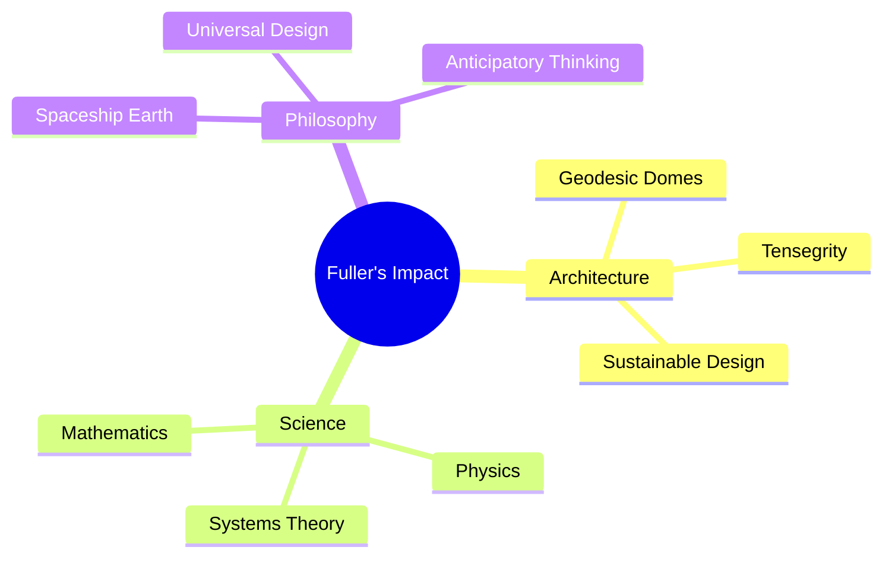

---

## 💡 Innovative Applications

### [[Modern_Projects|Current Projects]]
- [[Smart_Materials|Smart Material Systems]]
- [[Responsive_Architecture|Responsive Buildings]]
- [[Energy_Systems|Energy Solutions]]

### [[Future_Directions|Future Directions]]
- [[AI_Integration|AI & Machine Learning]]
- [[Quantum_Computing|Quantum Applications]]
- [[Space_Development|Space Exploration]]

---

## 🛠️ Technical Implementation

### Repository Architecture
```ascii
+------------------+
|    Interface     |
|  +-----------+  |
|  |  Content  |  |
|  |  Engine   |  |
|  +-----------+  |
+------------------+
        ↓
+------------------+
|  Knowledge Base  |
|  +-----------+  |
|  |  Graph DB  |  |
|  +-----------+  |
+------------------+
```

---

## 🧩 Integration Patterns

### [[System_Integration|System Integration]]
```python
class KnowledgeIntegrator:
    async def integrate(self, node: Node) -> Graph:
        connections = await self.find_connections(node)
        graph = await self.build_graph(connections)
        return self.optimize(graph)
```

### [[Data_Flow|Data Flow]]
1. Content Ingestion
2. Pattern Recognition
3. Connection Mapping
4. Knowledge Synthesis

---

## 🎯 Strategic Vision

### Immediate Goals
- [[Content_Expansion|Expand Content]]
- [[Tool_Development|Enhance Tools]]
- [[Community_Building|Build Community]]

### Long-term Vision
- [[Global_Impact|Global Reach]]
- [[Educational_Integration|Educational Integration]]
- [[Research_Advancement|Research Platform]]

---

## 🌍 Global Impact

### [[Success_Stories|Success Stories]]
- [[Case_Study_1|Sustainable Communities]]
- [[Case_Study_2|Educational Programs]]
- [[Case_Study_3|Research Breakthroughs]]

### [[Future_Possibilities|Future Possibilities]]
- [[Global_Solutions|Global Solutions]]
- [[Space_Exploration|Space Development]]
- [[Sustainable_Future|Sustainable Future]]

---

## 🧭 Navigation & Tools

### Advanced Features
```python
# Example tool usage
explorer = KnowledgeExplorer()
results = await explorer.search(
    concept="tensegrity",
    depth=3,
    include_related=True
)
```

### [[Tool_Documentation|Documentation]]
- [[API_Reference|API Reference]]
- [[Usage_Examples|Usage Examples]]
- [[Best_Practices|Best Practices]]

---

## 🎨 Design Principles

### [[Visual_Language|Visual System]]
- [[Color_Theory|Color Usage]]
- [[Typography|Typography]]
- [[Layout_Systems|Layout]]

### [[Interaction_Design|Interaction]]
- [[Navigation_Patterns|Navigation]]
- [[User_Flows|User Flows]]
- [[Feedback_Systems|Feedback]]

---

## 🚀 Next Steps

### Immediate Actions
1. [[Setup_Guide|Complete Setup]]
2. [[First_Steps|First Steps]]
3. [[Initial_Contribution|First Contribution]]

### Growth Path
1. [[Learning_Path|Study Path]]
2. [[Contribution_Path|Contribution Path]]
3. [[Leadership_Path|Leadership Path]]

---

## 💫 Inspiration Gallery

> "The best way to predict the future is to design it."

![[fuller_innovations]]

### Notable Projects
- [[Montreal_Biosphere|Montreal Biosphere]]
- [[Eden_Project|Eden Project]]
- [[Fly_Eye_Dome|Fly's Eye Dome]]

---

## 🌟 Join the Movement

### Get Involved
- [[Join_Community|Join Community]]
- [[Start_Contributing|Start Contributing]]
- [[Share_Knowledge|Share Knowledge]]

> "We are all astronauts on a little spaceship called Earth."

---

## 🙏 Thank You

> "The best way to predict the future is to design it."
> — Buckminster Fuller

### Begin Your Journey
```bash
./run
```

[[README|Return to Main Documentation]]

## 📐 Advanced Geometric Foundations

### Vector Equilibrium Mathematics
\[
\vec{F}_{\text{total}} = \sum_{i=1}^{12} \vec{F}_i = 0
\]

### Geodesic Frequency Relations
\[
f = \frac{n(n-1)}{2} + 1
\]

Where:
- f = number of vertices
- n = frequency of subdivision

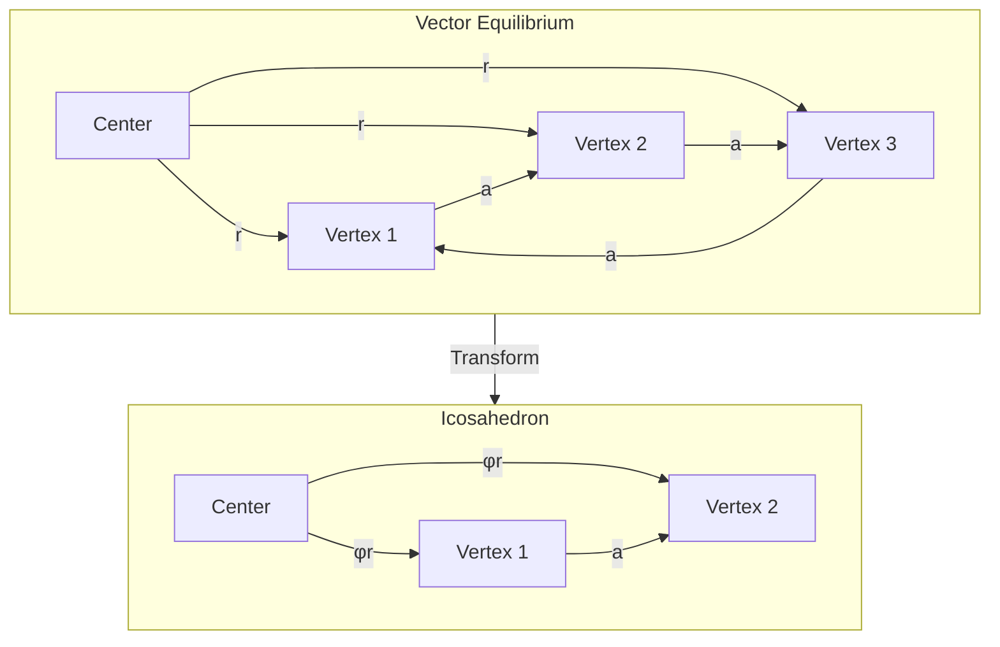

---

## 🧬 Complex Systems Analysis

### Tensegrity State Equations
\[
\begin{bmatrix} 
F_1 \\ F_2 \\ \vdots \\ F_n
\end{bmatrix} = 
\begin{bmatrix}
k_{11} & k_{12} & \cdots & k_{1n} \\
k_{21} & k_{22} & \cdots & k_{2n} \\
\vdots & \vdots & \ddots & \vdots \\
k_{n1} & k_{n2} & \cdots & k_{nn}
\end{bmatrix}
\begin{bmatrix}
\delta_1 \\ \delta_2 \\ \vdots \\ \delta_n
\end{bmatrix}
\]

### System Dynamics
```python
class TensegritySystem:
    def __init__(self, nodes: List[Node], edges: List[Edge]):
        self.energy_matrix = np.zeros((len(nodes), len(nodes)))
        self.tension_vectors = []
        self.compression_states = []
    
    def calculate_equilibrium(self) -> np.ndarray:
        return np.linalg.solve(
            self.energy_matrix, 
            self.external_forces
        )
```

---

## 🔮 Quantum Computing Integration

### Quantum State Optimization
\[
|\psi\rangle = \sum_{i=0}^{N-1} \alpha_i |i\rangle
\]

```python
def quantum_structure_optimizer(
    structure: TensegritySystem,
    qubits: int = 8
) -> OptimalState:
    circuit = QuantumCircuit(qubits)
    circuit.h(range(qubits))  # Superposition
    circuit.barrier()
    
    # Apply structure constraints
    for constraint in structure.constraints:
        circuit.append(constraint.to_gate())
    
    return execute_and_measure(circuit)
```

---

## 🧮 Advanced Mathematical Models

### Synergetic Coordinate Systems
\[
\begin{cases}
x = r \cos\theta \sin\phi \\
y = r \sin\theta \sin\phi \\
z = r \cos\phi
\end{cases}
\]

### Transformation Matrices
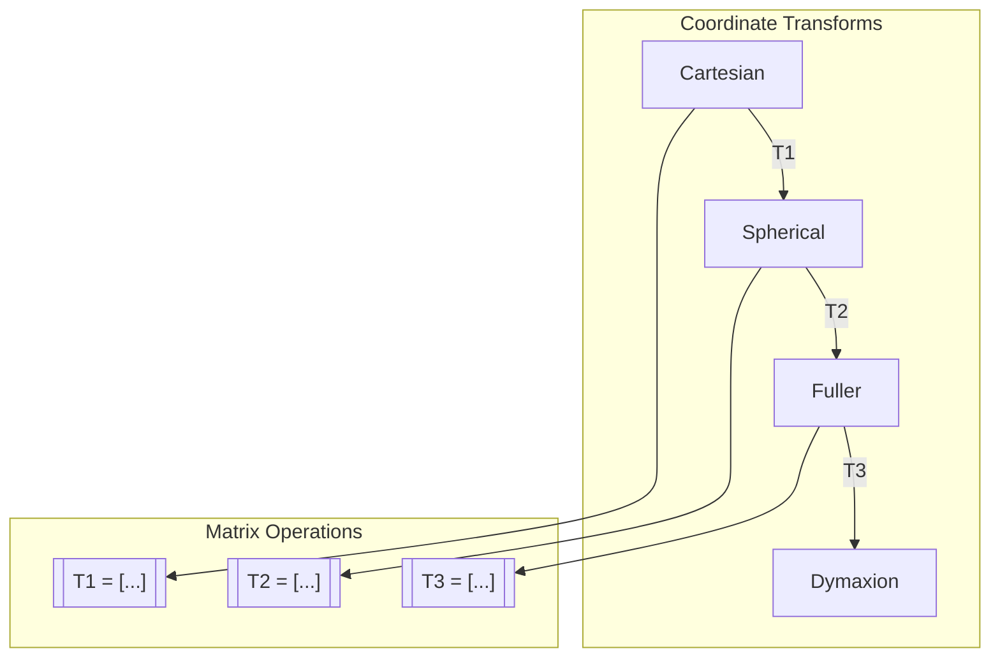

---

## 🎲 Probabilistic Design Systems

### Bayesian Optimization
\[
P(\theta|D) = \frac{P(D|\theta)P(\theta)}{P(D)}
\]

```python
class StructuralOptimizer:
    def __init__(self):
        self.prior = MultivariateNormal(0, I)
        self.likelihood = GaussianProcess()
        
    async def optimize(self, 
                      constraints: List[Constraint],
                      objective: Callable) -> Structure:
        posterior = await self.compute_posterior(
            self.prior, self.likelihood)
        return self.find_map_estimate(posterior)
```

---

## 🌌 Spacetime Geometry

### Fuller's Time-Space Coordinates
\[
ds^2 = -c^2dt^2 + a^2(t)(dr^2 + r^2d\Omega^2)
\]

### 4D Visualization
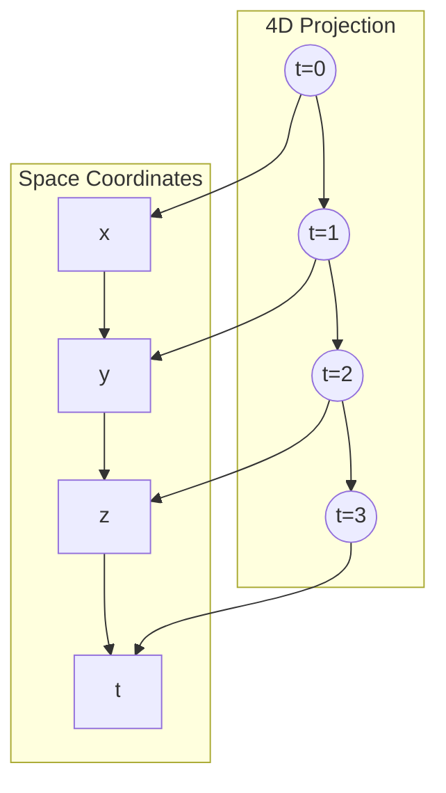

---

## 🧪 Quantum Field Applications

### Field Equations
\[
\mathcal{L} = -\frac{1}{4}F_{\mu\nu}F^{\mu\nu} + \bar{\psi}(i\gamma^\mu D_\mu - m)\psi
\]

### Implementation
```python
class QuantumFieldSimulator:
    def __init__(self, dimensions: int = 4):
        self.metric = MinkowskiMetric(dimensions)
        self.fields = QuantumFields()
        
    def evolve(self, 
               initial_state: QuantumState,
               time_steps: int) -> List[QuantumState]:
        states = []
        for t in range(time_steps):
            state = self.hamiltonian.apply(initial_state)
            states.append(state)
        return states
```

---

## 🎯 Neural Architecture Search

### Network Optimization
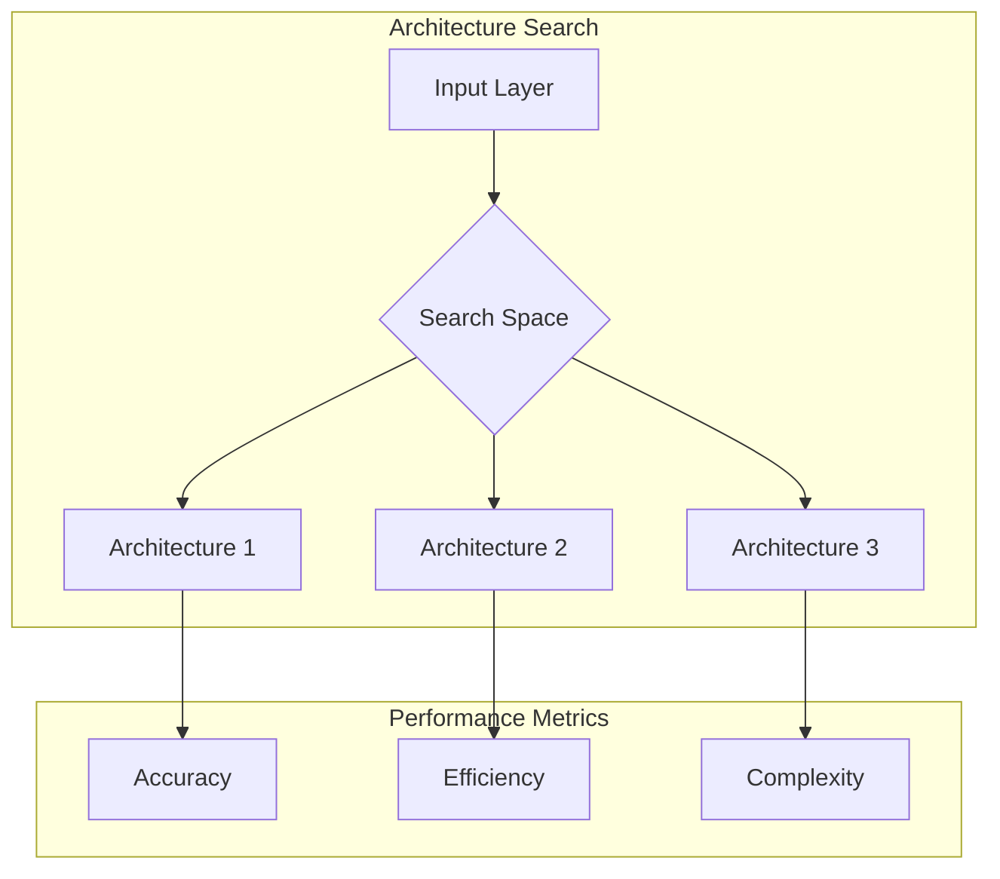

### Implementation
```python
class ArchitectureOptimizer:
    def __init__(self, search_space: SearchSpace):
        self.search_space = search_space
        self.controller = RNNController()
        
    async def search(self) -> Architecture:
        child_arch = self.controller.sample()
        performance = await self.evaluate(child_arch)
        self.controller.update(performance)
        return self.best_architecture
```

## 🔄 System Architecture Overview

### Complete System Integration
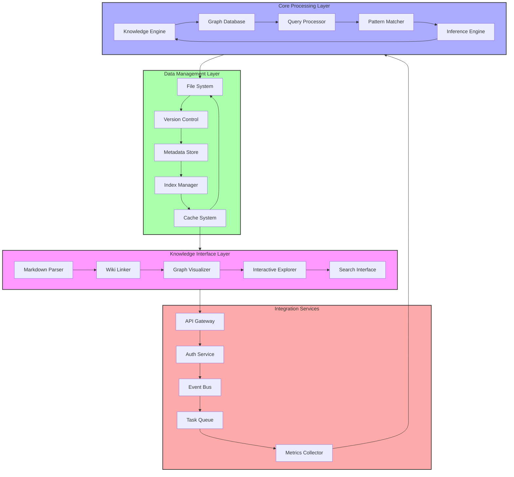

---

## 🧬 Knowledge Graph Structure

### Comprehensive Entity Relationships
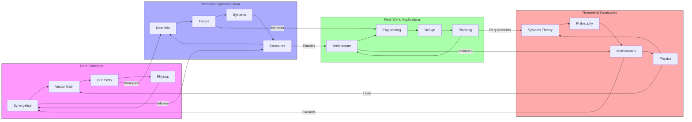

---

## 🔄 Process Workflows

### Development and Integration Pipeline
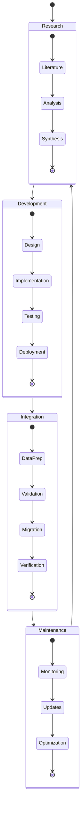

---

## 🎯 Component Architecture

### Detailed System Components
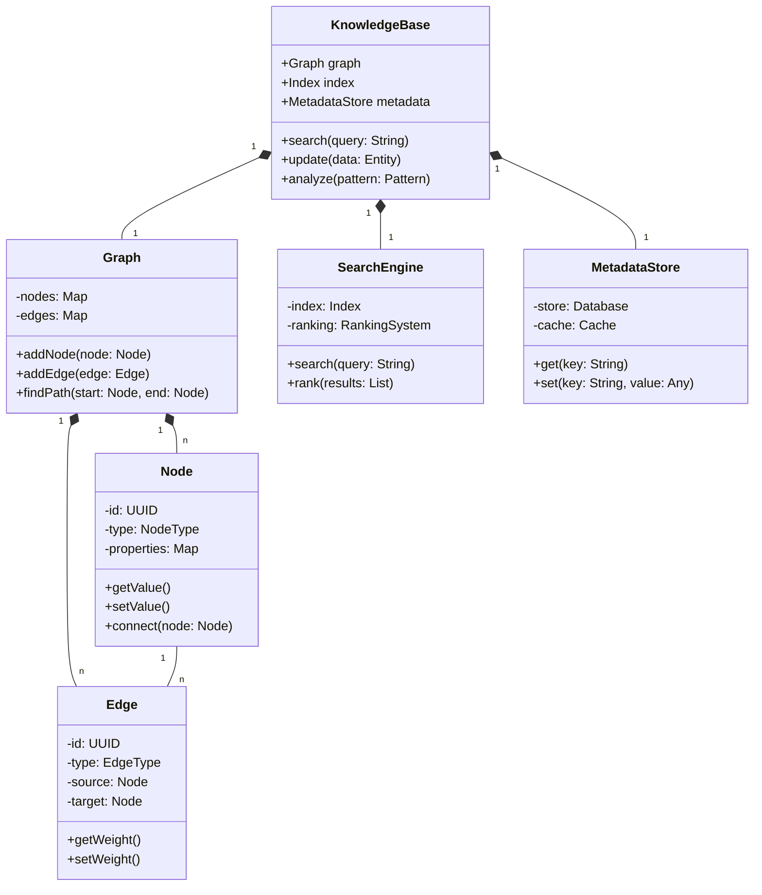

---

## 🌐 Network Topology

### System Interconnections
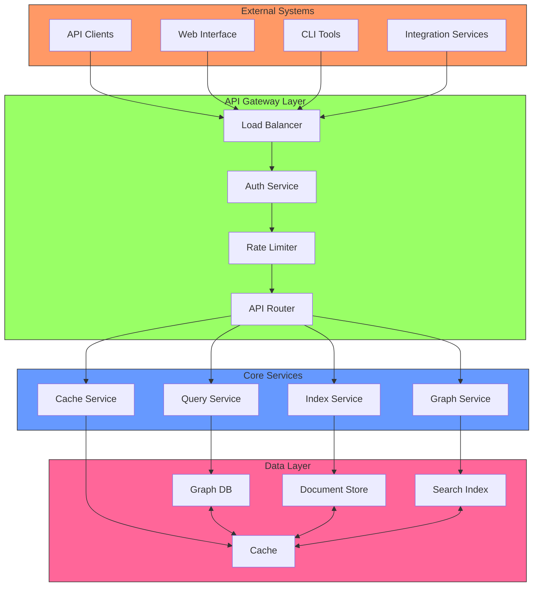

---

## 🔄 Event Processing Flow

### Event-Driven Architecture
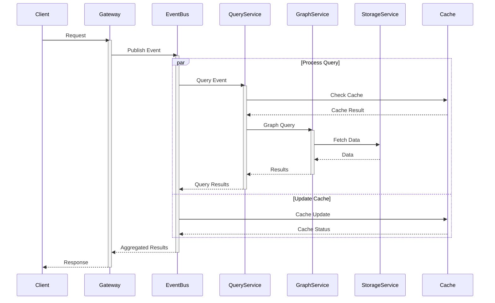

---

## 🧮 Data Processing Pipeline

### ETL and Analysis Flow
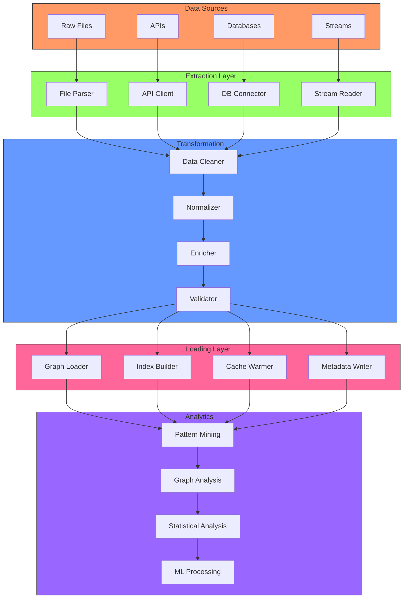

## 🔄 Live Sync & Resources

### Live Resources
- 🌐 **Live Obsidian Sync**: [Synergetics Knowledge Graph](https://publish.obsidian.md/synergetics)
- 💻 **GitHub Repository**: [School of Tomorrow](https://github.com/docxology/School_of_Tomorrow/)

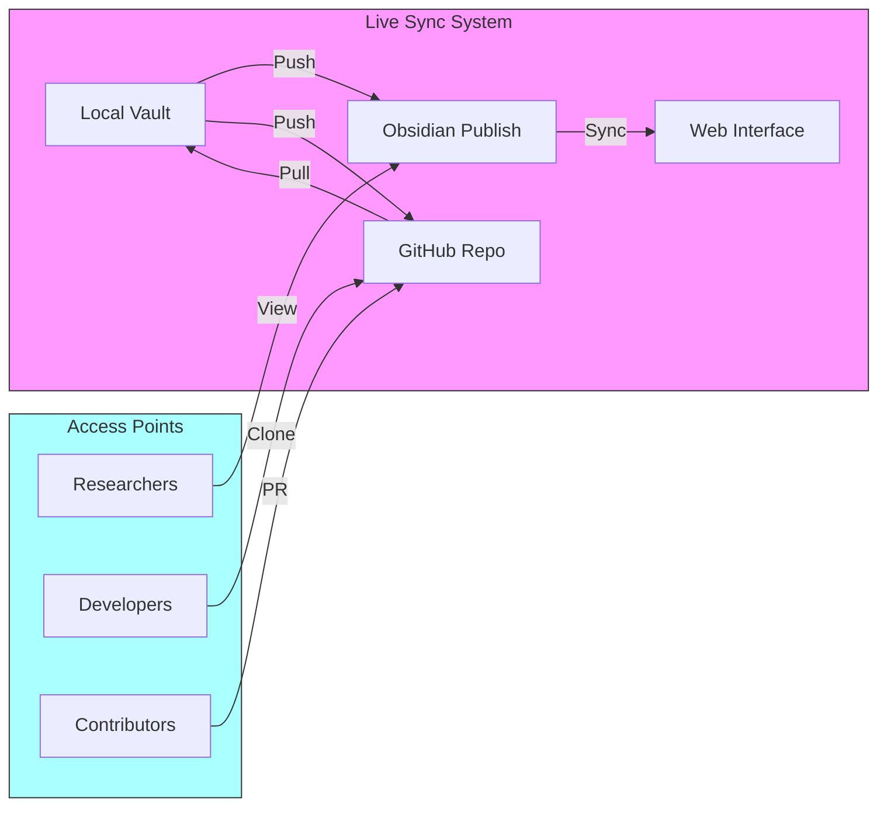

### GitHub Integration Tools
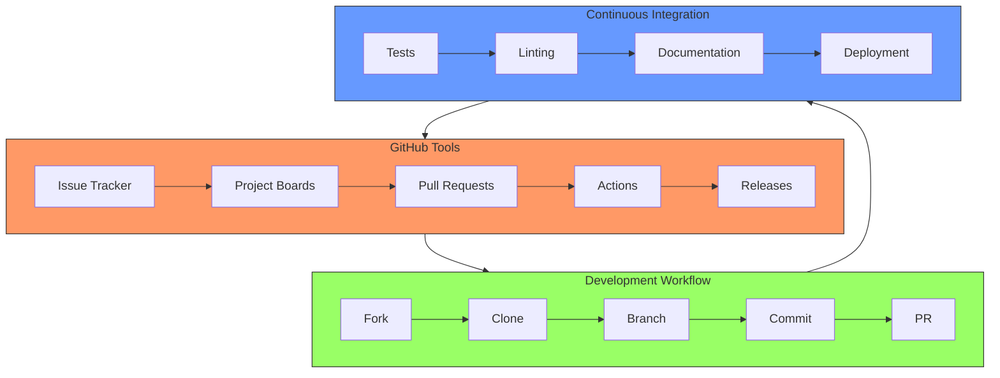

### Collaboration Features
1. **Version Control**
   - Git-based history
   - Branch management
   - Merge conflict resolution

2. **Documentation**
   - Automated builds
   - Live previews
   - Search indexing

3. **Community Tools**
   - Issue discussions
   - Project planning
   - Code review system
``` 