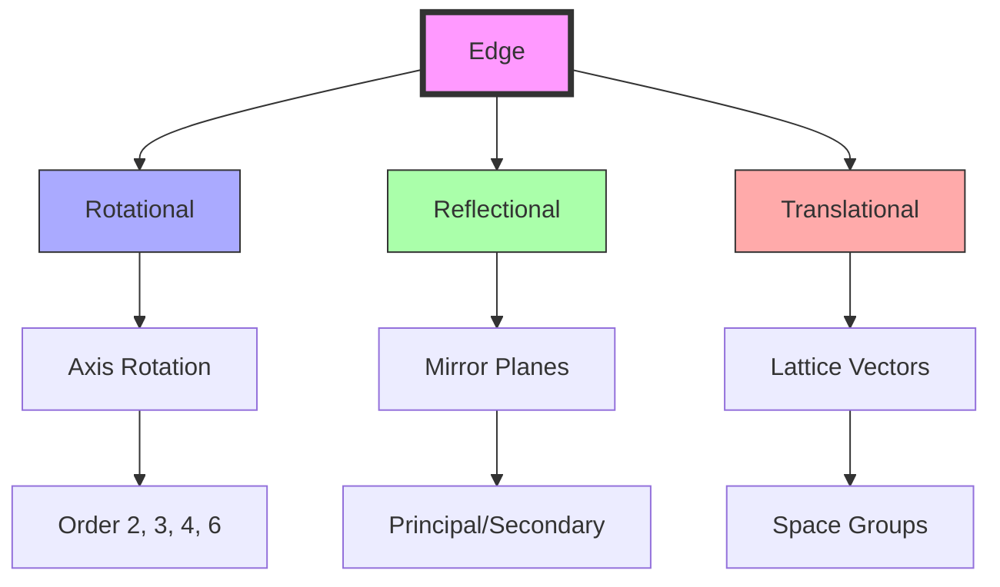
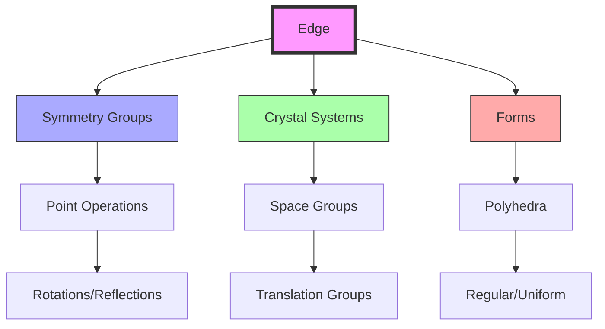
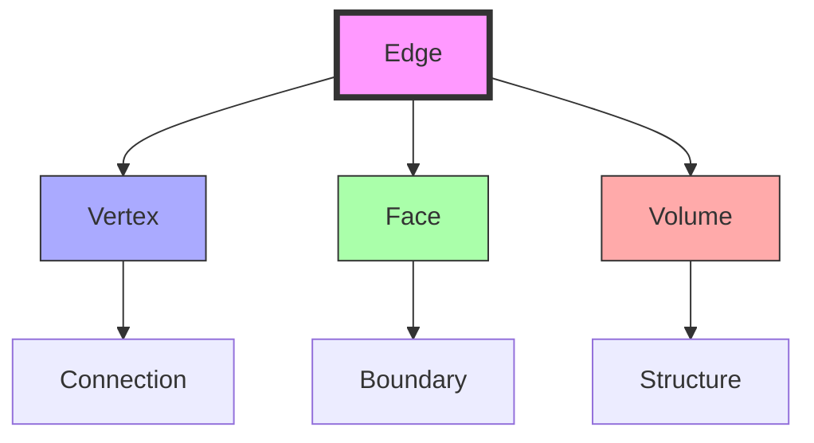
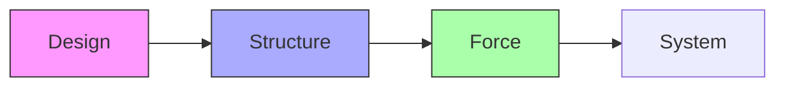

# Edge

An edge represents a one-dimensional line connecting two [[Vertex]], forming the basic structural element in geometric systems. In [[Synergetics_Geometry]], edges define the relationships between vertices and the boundaries of [[Plane]], from the [[Triangle]] (3 edges) to the [[Tetrahedron]] (6 edges) and beyond.

## Topological Properties

### Basic Characteristics
```yaml
properties:
  dimension: 1
  connectivity: 2 vertices
  direction: vector
  fundamental: true  # basic structural element
```

### System Relationships
1. Regular Polygons
   - [[Triangle]]: 3 edges
   - [[Square]]: 4 edges
   - Pentagon: 5 edges
   - Hexagon: 6 edges

2. Regular Polyhedra
   - [[Tetrahedron]]: 6 edges
   - [[Cube]]: 12 edges
   - Octahedron: 12 edges
   - Icosahedron: 30 edges
   - Dodecahedron: 30 edges

## Geometric Hierarchy

### Dimensional Progression
```yaml
hierarchy:
  dimension: 1  # line-like
  defined_by:
    - [[Vertex]] (0D): Two vertices define an edge
  generates:
    - [[Plane]] (2D): Three edges define a triangle
    - [[Space]] (3D): Six edges define a tetrahedron
  contained_by:
    - [[Plane]]: As boundaries
    - [[Space]]: As structural elements
```

### Edge Networks
1. Polygonal Networks
```yaml
polygon_edges:
  triangle:
    count: 3
    length: uniform
    angles: 60°
    stability: inherent
  square:
    count: 4
    length: uniform
    angles: 90°
    stability: requires_diagonals
  hexagon:
    count: 6
    length: uniform
    angles: 120°
    stability: requires_triangulation
```

2. Polyhedral Networks
```yaml
polyhedron_edges:
  tetrahedron:
    count: 6
    per_vertex: 3
    per_face: 3
    dihedral_angle: 70.53°
  cube:
    count: 12
    per_vertex: 3
    per_face: 4
    dihedral_angle: 90°
  vector_equilibrium:
    count: 24
    per_vertex: 4
    per_face: [3, 4]  # triangular and square faces
    dihedral_angle: [60°, 90°]
```

### Edge Symmetry


## Advanced Properties

### Edge Mechanics
1. Force Components
```yaml
forces:
  axial:
    tension: positive
    compression: negative
    magnitude: scalar
  transverse:
    bending: vector
    shear: vector
    torsion: vector
```

2. Structural Properties
```yaml
structural:
  stiffness: elastic_modulus × area
  strength: yield_stress × area
  stability: buckling_load
  efficiency: strength_to_weight
```

### Geometric Transformations
1. Linear Operations
```yaml
linear_transforms:
  translation:
    vector: displacement
    preserves: length
  rotation:
    axis: arbitrary
    angle: continuous
  reflection:
    plane: mirror
    orientation: reversed
```

2. Network Operations
```yaml
network_operations:
  subdivision:
    frequency: n
    method: equal_division
  combination:
    joining: vertex_sharing
    branching: edge_splitting
  transformation:
    jitterbug: phase_change
    tensegrity: force_balance
```

## Geometric Transformations and Symmetries

### Edge Symmetry Operations
1. Linear Symmetries
```yaml
linear_symmetries:
  rotations:
    axis: edge_line
    order: 2
    notation: C2
  reflections:
    planes: [vertical, horizontal]
    count: infinite
    notation: σv, σh
  inversions:
    center: edge_midpoint
    operation: -1
    notation: i
```

2. Edge Orbits
```yaml
edge_orbits:
  tetrahedral:
    order: 24
    positions: 6
    stabilizer: C2
  cubic:
    order: 48
    positions: 12
    stabilizer: C2
  icosahedral:
    order: 120
    positions: 30
    stabilizer: C2
```

### Crystallographic Elements
1. Space Group Components
```yaml
space_components:
  translations:
    vectors: [a, b, c]
    periodicity: lattice_dependent
    notation: t(r)
  rotations:
    axes: [2, 3, 4, 6]
    screw_component: [21, 31, 41, 61]
    notation: nm
  reflections:
    glide_planes: [a, b, c, n, d]
    direction: translation + reflection
    notation: ga, gb, gc
```

2. Edge Positions
```yaml
edge_positions:
  special:
    rotation_axes: coincident
    mirror_planes: perpendicular
    inversion_centers: midpoint
  general:
    multiplicity: full_orbit
    site_symmetry: minimal
    orientation: arbitrary
```

### Form Integration


## Advanced Relationships

### Edge-Form Connections
1. Polygonal Systems
```yaml
polygon_edges:
  triangle:
    count: 3
    symmetry: D3
    stabilizer: C2
    orbit_structure: [3]
  square:
    count: 4
    symmetry: D4
    stabilizer: C2
    orbit_structure: [4]
  hexagon:
    count: 6
    symmetry: D6
    stabilizer: C2
    orbit_structure: [6]
```

2. Polyhedral Systems
```yaml
polyhedron_edges:
  tetrahedron:
    count: 6
    symmetry: Td
    stabilizer: C2
    orbit_structure: [6]
  cube:
    count: 12
    symmetry: Oh
    stabilizer: C2
    orbit_structure: [12]
  icosahedron:
    count: 30
    symmetry: Ih
    stabilizer: C2
    orbit_structure: [30]
```

### Edge Networks
1. Connection Patterns
```yaml
edge_networks:
  vertex_sharing:
    minimum: 1  # endpoint
    maximum: 2  # endpoints
    multiplicity: coordination_number
  face_sharing:
    minimum: 1  # boundary
    maximum: 2  # shared edge
    arrangement: cyclic
```

2. Network Properties
```yaml
network_properties:
  connectivity:
    degree: vertex_count
    valence: face_count
    coordination: edge_sharing
  metrics:
    centrality: path_importance
    betweenness: flow_control
    clustering: local_density
```

### Force Distribution
1. Static Analysis
```yaml
static_forces:
  axial:
    tension: positive
    compression: negative
    distribution: uniform
  bending:
    moment: perpendicular
    shear: transverse
    torsion: rotational
```

2. Dynamic Response
```yaml
dynamic_response:
  modes:
    axial: longitudinal_waves
    transverse: bending_waves
    torsional: twisting_waves
  frequencies:
    fundamental: base_mode
    harmonics: overtones
    coupling: mode_interaction
```

## Mathematical Structure

### Edge Properties
1. Structural Relationships
```yaml
connections:
  minimum_polygon: 3  # triangle
  minimum_system: 6  # tetrahedron
  vector_equilibrium: 24
  coordination:
    triangle: 2 vertices per edge
    tetrahedron: 2 vertices per edge
    cube: 2 vertices per edge
```

2. Force Relationships
```yaml
forces:
  tension: along edge
  compression: along edge
  bending: perpendicular to edge
  torsion: around edge axis
```

### Edge Framework


## Synergetic Significance

### System Integration
1. Basic Relationships
   - Connects [[Vertex]]
   - Bounds [[Plane]]
   - Defines [[Space]] structure
   - Forms system networks

2. Structural Properties
   - Force transmission
   - System definition
   - Pattern formation
   - Spatial organization

### Edge Organization
```mermaid
mindmap
    root((Edge))
        Structure
            [[Vertex]]
            [[Face]]
            [[Volume]]
        Forces
            [[Tension]]
            [[Compression]]
            [[Stability]]
```

## Applications

### Structural Uses
1. Engineering Applications
   - Structural members
   - Force paths
   - System boundaries
   - Connection elements

2. Design Implementation
   - Building components
   - Space frame struts
   - Tensegrity elements
   - Network connections

### Implementation Framework


## Integration with Forms

### Form Relationships
1. Basic Forms
   - [[Triangle]]: 3 edges defining minimum stability
   - [[Square]]: 4 edges requiring bracing
   - [[Tetrahedron]]: 6 edges defining minimum system
   - [[Cube]]: 12 edges in orthogonal system

2. Complex Systems
   - [[Vector_Equilibrium]]: 24 edges in equilibrium
   - [[Isotropic_Vector_Matrix]]: Infinite edge network
   - [[Geodesic_Mathematics]]: Frequency-based edges
   - [[Space_Frames]]: Structural edge patterns

## Mathematical Analysis

### Edge Calculations
\[
\begin{align*}
E_{polygon} &= V \text{ (number of vertices)} \\
E_{polyhedron} &= \frac{3V - 6}{2} \text{ (for simple polyhedra)} \\
E_{coordination} &= \frac{2E}{V} \text{ (average per vertex)}
\end{align*}
\]

### System Relationships
```yaml
edge_counts:
  minimum_polygon: 3  # triangle
  minimum_system: 6  # tetrahedron
  cube_system: 12
  ve_system: 24
```

## Conceptual Integration

### Historical Development
1. Mathematical Origins
```yaml
historical_development:
  ancient:
    greek:
      - Euclid: line segments
      - Apollonius: conic sections
    islamic:
      - Al-Khwarizmi: linear elements
      - Omar Khayyam: geometric edges
  modern:
    - [[Fuller_Buckminster]]: synergetic edges
    - [[Snelson_Kenneth]]: tensegrity edges
    - [[Edmondson_Amy]]: structural analysis
```

2. Research Centers
```yaml
research_centers:
  modern:
    - [[Active_Inference_Institute]]:
        location: [[Crescent_City]]
        focus: structural connections
    - [[Math4Wisdom]]:
        focus: mathematical relationships
        applications: force systems
    - [[Design_Science_Studios]]:
        focus: practical implementation
        applications: structural design
```

### System Connections
1. Theoretical Frameworks
```yaml
frameworks:
  geometric:
    - [[Synergetics_Geometry]]: edge relationships
    - [[Vector_Equilibrium]]: 24-edge system
    - [[Isotropic_Vector_Matrix]]: edge networks
  structural:
    - [[Tensegrity]]: tension/compression
    - [[Space_Frames]]: edge structures
    - [[Geodesic_Mathematics]]: edge frequencies
```

2. Practical Applications
```yaml
applications:
  engineering:
    - [[System_Analysis]]: force paths
    - [[Pattern_Formation]]: edge networks
    - [[System_Innovation]]: edge optimization
  architectural:
    - [[Geodesic_Dome]]: structural edges
    - [[Space_Frames]]: load paths
    - [[Tensegrity]]: force edges
```

### Educational Integration
1. Teaching Programs
```yaml
education:
  institutions:
    - [[Global_University]]:
        focus: structural understanding
        methods: practical application
    - [[Design_Science_Studios]]:
        focus: construction principles
        methods: hands-on building
  research:
    - [[Trimtab_Reading_Group]]:
        focus: theoretical foundations
        methods: collaborative study
```

2. Learning Resources
```yaml
resources:
  publications:
    - [[Synergetics]]: edge principles
    - [[Synergetics_2]]: advanced concepts
    - [[Edge_Analysis]]: technical studies
  workshops:
    - [[Math4Wisdom]]:
        focus: mathematical principles
        format: theoretical investigation
```

### Interdisciplinary Connections
1. Scientific Fields
```yaml
scientific_connections:
  physics:
    - quantum_edges: field lines
    - graph_theory: edge networks
    - crystallography: bond edges
  biology:
    - molecular_bonds: chemical edges
    - cellular_structure: membrane edges
    - neural_pathways: connection edges
```

2. Design Applications
```yaml
design_applications:
  construction:
    - [[Space_Frames]]: structural members
    - [[Tensegrity]]: tension elements
    - [[Geodesic_Mathematics]]: edge patterns
  systems:
    - [[System_Innovation]]: edge optimization
    - [[Pattern_Recognition]]: edge networks
    - [[Active_Inference]]: edge behavior
```

### Future Developments
1. Research Directions
```yaml
research_areas:
  theoretical:
    - quantum_networks: edge operators
    - topological_edges: network theory
    - computational_edges: algorithmic analysis
  practical:
    - nano_structures: molecular edges
    - bio_engineering: structural edges
    - smart_materials: adaptive edges
```

2. Innovation Potential
```yaml
innovations:
  emerging:
    - [[System_Innovation]]: edge optimization
    - [[Pattern_Recognition]]: edge networks
    - [[Active_Inference]]: predictive systems
  applications:
    - [[Digital_Democracy]]: digital edges
    - [[Cognitive_Security]]: information systems
    - [[System_Development]]: growth systems
```

## References

### Primary Sources
1. [[Synergetics]] (Fuller, 1975)
2. [[Synergetics_2]] (Fuller, 1979)
3. [[Edge_Analysis]] (Edmondson, 1987)
4. [[Structural_Systems]] (Loeb, 1976)

### Related Terms
- [[Vertex]]: Edge endpoints
- [[Plane]]: Bounded by edges
- [[Space]]: Structured by edges
- [[Line]]: Geometric equivalent

## Notes
- Basic structural element
- Force transmission path
- System boundary definition
- Pattern formation component

## Tags
#geometry #topology #synergetics #structure 