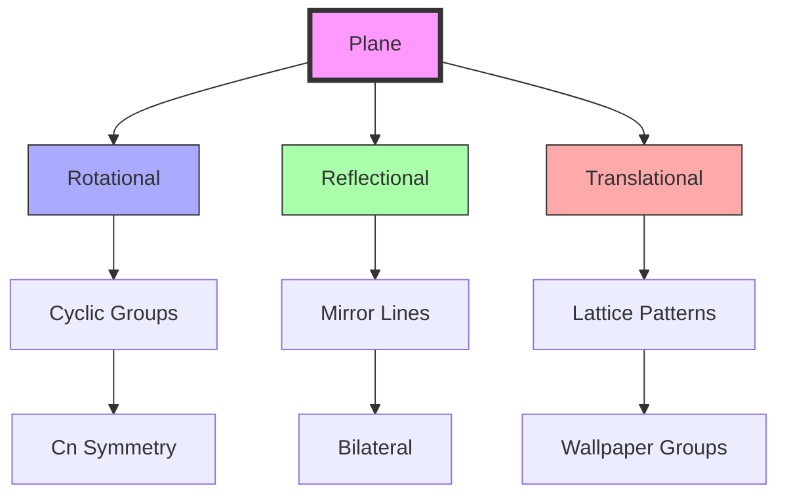
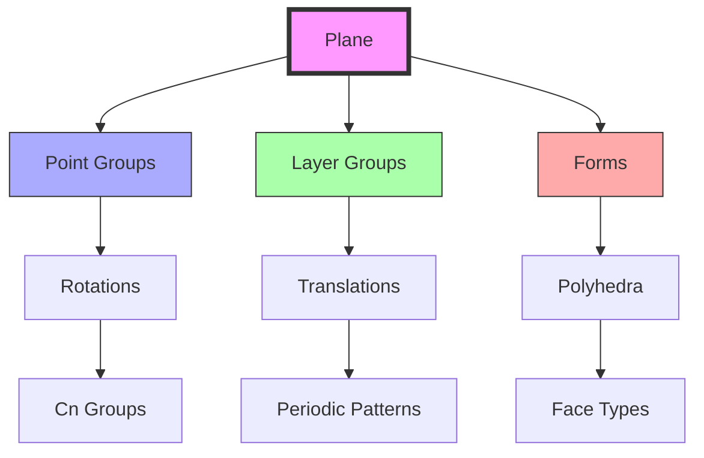
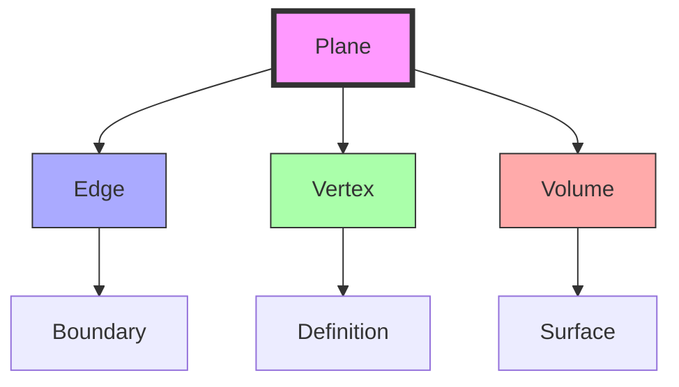
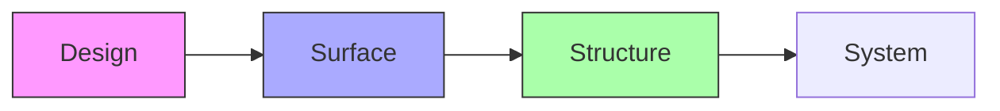

# Plane

A plane represents a two-dimensional surface bounded by [[Edge]] and defined by [[Vertex]]. In [[Synergetics_Geometry]], planes form the faces of polyhedra, from the triangular faces of the [[Tetrahedron]] to the square faces of the [[Cube]].

## Topological Properties

### Basic Characteristics
```yaml
properties:
  dimension: 2
  boundary: edges
  vertices: minimum 3
  fundamental: true  # basic surface element
```

### System Relationships
1. Regular Polygon Faces
   - [[Triangle]]: 1 face, 3 edges
   - [[Square]]: 1 face, 4 edges
   - Pentagon: 1 face, 5 edges
   - Hexagon: 1 face, 6 edges

2. Regular Polyhedron Faces
   - [[Tetrahedron]]: 4 triangular faces
   - [[Cube]]: 6 square faces
   - Octahedron: 8 triangular faces
   - Icosahedron: 20 triangular faces
   - Dodecahedron: 12 pentagonal faces

## Geometric Hierarchy

### Dimensional Progression
```yaml
hierarchy:
  dimension: 2  # surface-like
  defined_by:
    - [[Vertex]] (0D): Three non-collinear vertices
    - [[Edge]] (1D): Three edges forming a triangle
  generates:
    - [[Space]] (3D): Four planes define a tetrahedron
  contains:
    - [[Vertex]]: As corners
    - [[Edge]]: As boundaries
```

### Plane Configurations
1. Regular Polygons
```yaml
polygon_planes:
  triangle:
    vertices: 3
    edges: 3
    interior_angles: 60°
    area_formula: a²√3/4
  square:
    vertices: 4
    edges: 4
    interior_angles: 90°
    area_formula: a²
  hexagon:
    vertices: 6
    edges: 6
    interior_angles: 120°
    area_formula: 3a²√3/2
```

2. Polyhedron Faces
```yaml
polyhedron_faces:
  tetrahedron:
    type: triangular
    count: 4
    area_ratio: 1.0  # normalized
    dihedral_angle: 70.53°
  cube:
    type: square
    count: 6
    area_ratio: 1.732
    dihedral_angle: 90°
  vector_equilibrium:
    types: [triangular, square]
    counts: [8, 6]
    area_ratios: [1.0, 1.333]
    dihedral_angles: [60°, 90°]
```

### Plane Symmetry


## Geometric Transformations and Symmetries

### Plane Symmetry Operations
1. Two-Dimensional Symmetries
```yaml
planar_symmetries:
  rotations:
    orders: [2, 3, 4, 6]
    centers: points
    notation: Cn
  reflections:
    lines: mirror_lines
    count: finite/infinite
    notation: m
  glide_reflections:
    translation: vector
    reflection: line
    notation: g
```

2. Wallpaper Groups
```yaml
wallpaper_groups:
  primitive:
    p1: translation_only
    p2: 2-fold_rotation
    pm: reflection
    pg: glide_reflection
  centered:
    cm: centered_reflection
    pmm: two_perpendicular_reflections
    p4m: 4-fold_rotation_reflection
    p6m: 6-fold_rotation_reflection
```

### Crystallographic Elements
1. Layer Groups
```yaml
layer_groups:
  types:
    rod: one_periodic
    frieze: two_periodic
    wallpaper: plane_periodic
  operations:
    translations: [t1, t2]
    rotations: [2, 3, 4, 6]
    reflections: [m, g]
```

2. Plane Positions
```yaml
plane_positions:
  special:
    rotation_centers: fixed_points
    mirror_lines: fixed_lines
    glide_lines: translation_paths
  general:
    multiplicity: orbit_size
    symmetry: site_group
    position: arbitrary
```

### Form Integration


## Advanced Relationships

### Plane-Form Connections
1. Regular Polygons
```yaml
polygon_planes:
  triangle:
    symmetry: D3
    angles: [60°, 60°, 60°]
    area_ratio: 1.0
    tiling: regular
  square:
    symmetry: D4
    angles: [90°, 90°, 90°, 90°]
    area_ratio: 2.309
    tiling: regular
  hexagon:
    symmetry: D6
    angles: [120°] × 6
    area_ratio: 6.928
    tiling: regular
```

2. Polyhedron Faces
```yaml
polyhedron_faces:
  tetrahedron:
    type: equilateral_triangle
    count: 4
    symmetry: D3
    dihedral: 70.53°
  cube:
    type: square
    count: 6
    symmetry: D4
    dihedral: 90°
  dodecahedron:
    type: regular_pentagon
    count: 12
    symmetry: D5
    dihedral: 116.57°
```

### Plane Networks
1. Tiling Patterns
```yaml
tilings:
  regular:
    triangle: [3.3.3.3.3.3]
    square: [4.4.4.4]
    hexagon: [6.6.6]
  semi_regular:
    types: [3.3.3.4.4, 3.3.4.3.4]
    vertex_config: uniform
    face_types: mixed
```

2. Network Properties
```yaml
network_properties:
  connectivity:
    edge_sharing: adjacent_faces
    vertex_sharing: corner_faces
    face_rings: surrounding_faces
  metrics:
    planarity: deviation_from_plane
    regularity: angle_variance
    symmetry: operation_count
```

### Surface Analysis
1. Differential Properties
```yaml
differential:
  tangent_space:
    vectors: basis_pair
    metric: inner_product
    orientation: normal_vector
  curvature:
    gaussian: K = 0
    mean: H = 0
    principal: κ1 = κ2 = 0
```

2. Integral Properties
```yaml
integral:
  area:
    methods: [triangulation, integration]
    boundary: closed_curve
    orientation: signed_area
  moments:
    first: centroid
    second: inertia_tensor
    higher: shape_descriptors
```

## Advanced Properties

### Surface Characteristics
1. Metric Properties
```yaml
metrics:
  area: bounded_region
  perimeter: boundary_length
  angles:
    interior: (n-2)π/n
    exterior: 2π/n
  ratios:
    isoperimetric: 4πA/P²
```

2. Geometric Properties
```yaml
geometry:
  curvature: zero
  torsion: zero
  normal_vector: perpendicular
  tangent_plane: self
```

### Plane Transformations
1. Isometric Operations
```yaml
isometries:
  translation:
    vector: any_planar
    preserves: all_distances
  rotation:
    center: any_point
    angle: continuous
  reflection:
    line: any_direction
    orientation: reversed
  glide_reflection:
    combination: translate_reflect
```

2. Similarity Operations
```yaml
similarities:
  dilation:
    center: any_point
    scale: positive_real
  stretch:
    direction: any_axis
    factor: real_number
  composition:
    sequence: multiple_transforms
    order: matters
```

### Tessellation Properties
1. Regular Tilings
```yaml
regular_tilings:
  triangle:
    vertex_config: 3.3.3.3.3.3
    internal_angle: 60°
    tiles_per_vertex: 6
  square:
    vertex_config: 4.4.4.4
    internal_angle: 90°
    tiles_per_vertex: 4
  hexagon:
    vertex_config: 6.6.6
    internal_angle: 120°
    tiles_per_vertex: 3
```

2. Space-Filling Properties
```yaml
space_filling:
  regular:
    types: [triangle, square, hexagon]
    efficiency: area_coverage
    symmetry: highest
  semi_regular:
    combinations: [3.3.3.4.4, 3.3.4.3.4]
    vertex_types: uniform
    symmetry: reduced
```

## Mathematical Structure

### Plane Properties
1. Face Characteristics
```yaml
faces:
  triangle:
    edges: 3
    vertices: 3
    angles: 180°
  square:
    edges: 4
    vertices: 4
    angles: 360°
  regular_polygon:
    edges: n
    vertices: n
    angles: (n-2)×180°
```

2. Surface Properties
```yaml
surface:
  orientation: defined by normal vector
  curvature: zero (flat)
  boundary: closed polygon
  intersection: forms edge or line
```

### Plane Framework


## Synergetic Significance

### System Integration
1. Basic Relationships
   - Bounded by [[Edge]]
   - Defined by [[Vertex]]
   - Forms [[Space]] boundaries
   - Creates system surfaces

2. Structural Properties
   - Surface definition
   - Force distribution
   - System boundaries
   - Pattern surfaces

### Plane Organization
```mermaid
mindmap
    root((Plane))
        Structure
            [[Edge]]
            [[Vertex]]
            [[Volume]]
        System
            [[Surface]]
            [[Boundary]]
            [[Pattern]]
```

## Applications

### Structural Uses
1. Engineering Applications
   - Surface elements
   - Structural faces
   - System boundaries
   - Pattern surfaces

2. Design Implementation
   - Building surfaces
   - Space enclosure
   - System definition
   - Pattern creation

### Implementation Framework


## Integration with Forms

### Form Relationships
1. Basic Forms
   - [[Triangle]]: Minimum stable plane
   - [[Square]]: Orthogonal plane
   - [[Tetrahedron]]: 4 triangular planes
   - [[Cube]]: 6 square planes

2. Complex Systems
   - [[Vector_Equilibrium]]: 14 planes (8 triangular, 6 square)
   - [[Isotropic_Vector_Matrix]]: Infinite plane network
   - [[Geodesic_Mathematics]]: Frequency-based planes
   - [[Space_Frames]]: Structural plane patterns

## Mathematical Analysis

### Area Calculations
\[
\begin{align*}
A_{triangle} &= \frac{1}{2}bh \text{ (base × height)} \\
A_{square} &= a^2 \text{ (edge length squared)} \\
A_{polygon} &= \frac{n}{4}a^2\cot(\frac{\pi}{n}) \text{ (regular n-gon)}
\end{align*}
\]

### System Relationships
```yaml
face_counts:
  minimum_system: 4  # tetrahedron
  cube_system: 6
  octahedron: 8
  ve_system: 14  # 8 triangular + 6 square
```

### Advanced Calculations
1. Plane Equations
\[
\begin{align*}
ax + by + cz + d &= 0 \text{ (general form)} \\
\vec{n}\cdot(\vec{r} - \vec{r}_0) &= 0 \text{ (point-normal form)} \\
\det(\vec{r} - \vec{r}_1, \vec{r}_2 - \vec{r}_1, \vec{r}_3 - \vec{r}_1) &= 0 \text{ (determinant form)}
\end{align*}
\]

2. Geometric Measures
\[
\begin{align*}
d_{point} &= \frac{|ax_0 + by_0 + cz_0 + d|}{\sqrt{a^2 + b^2 + c^2}} \text{ (point distance)} \\
\theta_{planes} &= \arccos\left(\frac{|\vec{n}_1\cdot\vec{n}_2|}{|\vec{n}_1||\vec{n}_2|}\right) \text{ (plane angle)} \\
A_{projection} &= A|\cos\theta| \text{ (projected area)}
\end{align*}
\]

### Plane Patterns
1. Symmetry Groups
```yaml
wallpaper_groups:
  p1: translation only
  p2: 2-fold rotation
  pm: reflection
  cm: glide reflection
  p4m: 4-fold rotation + reflection
```

2. Pattern Metrics
```yaml
pattern_analysis:
  density: motifs_per_area
  symmetry_order: transformation_count
  fundamental_domain: minimal_repeat
  coordination: neighbor_count
```

## Conceptual Integration

### Historical Development
1. Mathematical Origins
```yaml
historical_development:
  ancient:
    greek:
      - Euclid: plane geometry
      - Plato: ideal forms
    islamic:
      - Al-Khwarizmi: algebraic surfaces
      - Ibn al-Haytham: optical planes
  modern:
    - [[Fuller_Buckminster]]: synergetic planes
    - [[Loeb_Arthur]]: crystallographic planes
    - [[Edmondson_Amy]]: structural surfaces
```

2. Research Centers
```yaml
research_centers:
  modern:
    - [[Active_Inference_Institute]]:
        location: [[Crescent_City]]
        focus: surface dynamics
    - [[Math4Wisdom]]:
        focus: geometric principles
        applications: surface systems
    - [[Design_Science_Studios]]:
        focus: structural surfaces
        applications: architectural design
```

### System Connections
1. Theoretical Frameworks
```yaml
frameworks:
  geometric:
    - [[Synergetics_Geometry]]: plane relationships
    - [[Vector_Equilibrium]]: face systems
    - [[Isotropic_Vector_Matrix]]: plane networks
  structural:
    - [[Space_Frames]]: surface structures
    - [[Geodesic_Mathematics]]: spherical planes
    - [[Tensegrity]]: membrane forces
```

2. Practical Applications
```yaml
applications:
  engineering:
    - [[Surface_Analysis]]: plane behavior
    - [[Pattern_Formation]]: surface networks
    - [[System_Innovation]]: plane optimization
  architectural:
    - [[Geodesic_Dome]]: triangulated surfaces
    - [[Space_Frames]]: planar grids
    - [[Tensegrity]]: membrane planes
```

### Educational Integration
1. Teaching Programs
```yaml
education:
  institutions:
    - [[Global_University]]:
        focus: surface understanding
        methods: practical application
    - [[Design_Science_Studios]]:
        focus: surface design
        methods: hands-on construction
  research:
    - [[Trimtab_Reading_Group]]:
        focus: theoretical foundations
        methods: collaborative study
```

2. Learning Resources
```yaml
resources:
  publications:
    - [[Synergetics]]: plane principles
    - [[Synergetics_2]]: advanced surfaces
    - [[Surface_Analysis]]: technical studies
  workshops:
    - [[Math4Wisdom]]:
        focus: geometric principles
        format: theoretical investigation
```

### Interdisciplinary Connections
1. Scientific Fields
```yaml
scientific_connections:
  physics:
    - quantum_surfaces: field planes
    - membrane_theory: surface dynamics
    - crystallography: lattice planes
  biology:
    - cell_membranes: biological surfaces
    - tissue_structure: layered planes
    - morphogenesis: surface development
```

2. Design Applications
```yaml
design_applications:
  architecture:
    - [[Geodesic_Dome]]: structural planes
    - [[Space_Frames]]: planar networks
    - [[Tensegrity]]: force surfaces
  systems:
    - [[System_Innovation]]: plane optimization
    - [[Pattern_Recognition]]: surface networks
    - [[Active_Inference]]: plane behavior
```

### Future Developments
1. Research Directions
```yaml
research_areas:
  theoretical:
    - quantum_surfaces: membrane operators
    - topological_planes: surface theory
    - computational_planes: surface algorithms
  practical:
    - nano_surfaces: molecular planes
    - bio_membranes: living surfaces
    - smart_surfaces: adaptive planes
```

2. Innovation Potential
```yaml
innovations:
  emerging:
    - [[concepts/System_Innovation|Surface Design]]: plane optimization
    - [[concepts/Pattern_Recognition|Pattern Learning]]: surface networks
    - [[concepts/Active_Inference|Predictive Systems]]: plane behavior
  applications:
    - [[concepts/Digital_Democracy|Interface Systems]]: digital surfaces
    - [[concepts/Cognitive_Security|Information Planes]]: data surfaces
    - [[concepts/System_Development|Growth Systems]]: developmental planes
```

## References

### Primary Sources
1. [[books/Synergetics|Synergetics]] (Fuller, 1975)
2. [[books/Synergetics_2|Synergetics 2]] (Fuller, 1979)
3. [[papers/Surface_Analysis|Surface Analysis]] (Edmondson, 1987)
4. [[papers/Plane_Geometry|Plane Geometry]] (Loeb, 1976)

### Related Terms
- [[terms/Vertex|Vertex]] - Plane definition points
- [[terms/Edge|Edge]] - Plane boundaries
- [[terms/Space|Space]] - Bounded by planes
- [[terms/Face|Face]] - Physical plane manifestation

## Notes
- Basic surface element
- System boundary definition
- Force distribution surface
- Pattern formation basis

## Tags
#geometry #topology #synergetics #structure 

## Actionable Attention

### Priority Actions
```yaml
immediate_actions:
  structural:
    - Complete surface analysis documentation
    - Update geometric transformations
    - Document tessellation patterns
  documentation:
    - Add practical applications
    - Include construction methods
    - Expand mathematical proofs

pending_review:
  mathematical:
    - Verify plane equations
    - Check geometric measures
    - Review symmetry groups
  practical:
    - Test surface patterns
    - Analyze transformations
    - Document applications
```

### Implementation Notes
1. Critical Points
   - Complete transformation documentation
   - Verify geometric calculations
   - Update tessellation patterns
   - Document practical examples

2. System Integration
   - Expand surface relationships
   - Add construction guidelines
   - Include application methods
   - Document pattern systems

### Review Schedule
```yaml
quarterly_review:
  Q1:
    - Surface analysis
    - Geometric transformations
    - Mathematical proofs
  Q2:
    - Pattern systems
    - Transformation methods
    - Practical applications
  Q3:
    - Construction guidelines
    - System integration
    - Implementation examples
  Q4:
    - Documentation updates
    - Cross-references
    - Review standards
``` 