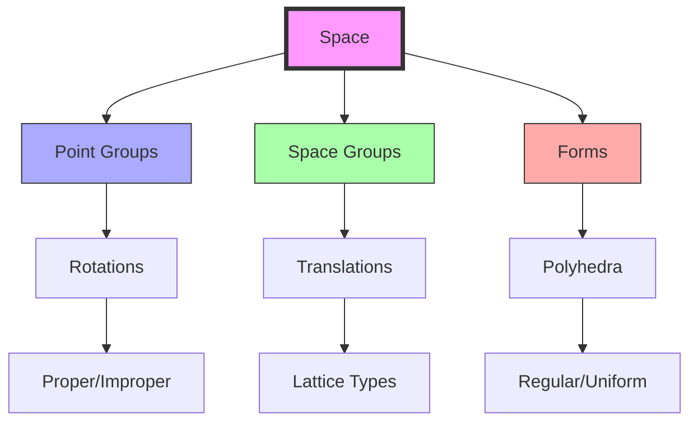
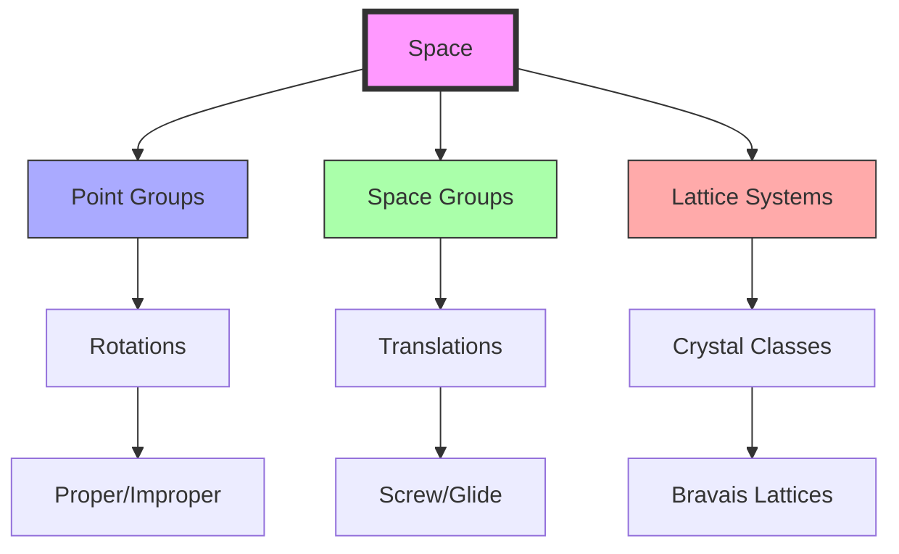
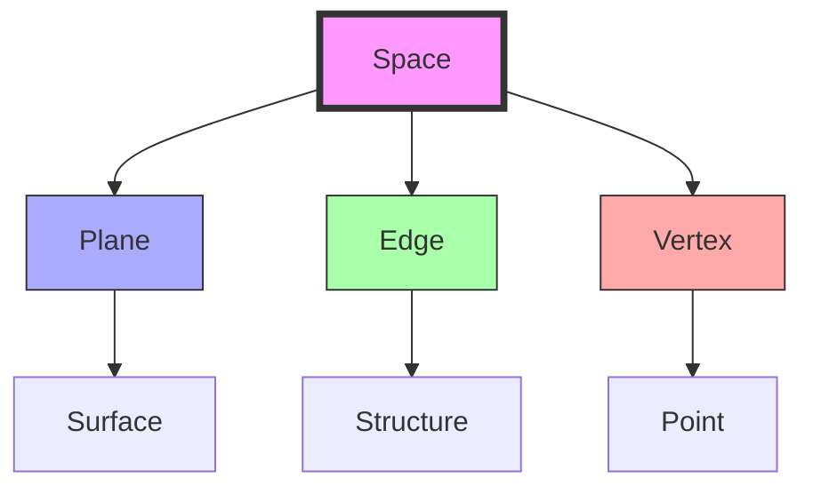
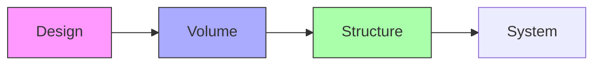

# Space

Space represents the three-dimensional domain bounded by [[Plane]], defined by [[Edge]], and anchored by [[Vertex]]. In [[Synergetics_Geometry]], space is quantized by the [[Tetrahedron]] as the minimum system of spatial definition.

## Topological Properties

### Basic Characteristics
```yaml
properties:
  dimension: 3
  boundary: planes
  edges: define structure
  vertices: define points
  fundamental: true  # basic volumetric element
```

## Geometric Transformations and Symmetries

### Space Group Operations
1. Point Symmetries
```yaml
point_symmetries:
  rotations:
    proper: [1, 2, 3, 4, 6]
    improper: [-1, -2, -3, -4, -6]
    notation: Cn, Sn
  reflections:
    mirror: σ
    glide: a, b, c, n, d
    notation: m, g
  inversions:
    center: origin
    operation: -1
    notation: i
```

2. Translation Symmetries
```yaml
translation_symmetries:
  lattice_types:
    primitive: P
    body_centered: I
    face_centered: F
    base_centered: C
  vectors:
    basis: [a, b, c]
    angles: [α, β, γ]
    metrics: direct/reciprocal
```

### Crystallographic Systems
1. Bravais Lattices
```yaml
bravais_lattices:
  cubic:
    types: [P, I, F]
    symmetry: m3m
    parameters: a = b = c, α = β = γ = 90°
  hexagonal:
    types: [P]
    symmetry: 6/mmm
    parameters: a = b ≠ c, α = β = 90°, γ = 120°
  tetragonal:
    types: [P, I]
    symmetry: 4/mmm
    parameters: a = b ≠ c, α = β = γ = 90°
```

2. Space Groups
```yaml
space_groups:
  operations:
    translations: t(r)
    rotations: n-fold
    screws: nm
    glides: ga, gb, gc
  classification:
    symmorphic: no_screw/glide
    non_symmorphic: with_screw/glide
    enantiomorphic: chiral_pairs
```

### Form Integration


## Geometric Hierarchy

### Dimensional Progression
```yaml
hierarchy:
  dimension: 3  # volumetric
  defined_by:
    - [[Vertex]] (0D): Four non-coplanar vertices
    - [[Edge]] (1D): Six edges forming a tetrahedron
    - [[Plane]] (2D): Four triangular faces
  contains:
    - [[Vertex]]: As points
    - [[Edge]]: As lines
    - [[Plane]]: As surfaces
```

### Space-Filling Systems
1. Regular Polyhedra
```yaml
polyhedra_volumes:
  tetrahedron:
    volume: 1.0  # base unit
    space_filling: no
    packing_efficiency: 0.3333
  cube:
    volume: 8.485281374238571
    space_filling: yes
    packing_efficiency: 1.0000
  octahedron:
    volume: 4.0
    space_filling: no
    packing_efficiency: 0.7071
```

2. Space Lattices
```yaml
crystal_systems:
  cubic:
    types: [simple, body-centered, face-centered]
    symmetry: highest
    packing_efficiency: [0.5236, 0.6802, 0.7405]
  hexagonal:
    types: [simple, close-packed]
    symmetry: 6-fold
    packing_efficiency: [0.6046, 0.7405]
  tetrahedral:
    types: [diamond, zinc-blende]
    symmetry: 4-fold
    packing_efficiency: [0.3401, 0.3401]
```

### Spatial Symmetry


## Advanced Properties

### Volume Characteristics
1. Metric Properties
```yaml
metrics:
  volume: bounded_region
  surface_area: boundary_area
  angles:
    dihedral: face_intersections
    solid: vertex_angles
  ratios:
    isoperimetric: 36πV²/A³
```

2. Topological Properties
```yaml
topology:
  euler_characteristic: V - E + F
  genus: number_of_holes
  connectivity: path_components
  boundary: closed_surface
```

### Space Transformations
1. Isometric Operations
```yaml
isometries:
  translation:
    vector: any_3d
    preserves: all_distances
  rotation:
    axis: any_line
    angle: continuous
  reflection:
    plane: any_plane
    orientation: reversed
  inversion:
    center: any_point
    scale: -1
```

2. Similarity Operations
```yaml
similarities:
  dilation:
    center: any_point
    scale: positive_real
  stretch:
    directions: [x, y, z]
    factors: real_numbers
  composition:
    sequence: multiple_transforms
    order: matters
```

### Space-Filling Properties
1. Regular Systems
```yaml
regular_systems:
  cubic:
    cell_types: [cube]
    vertex_config: 8.8.8.8
    space_group: Pm3m
  tetrahedral:
    cell_types: [tetrahedra]
    vertex_config: 3.3.3.3.3.3
    space_group: F4̄3m
  truncated:
    cell_types: [truncated_octahedra]
    vertex_config: 4.6.6.6
    space_group: Im3̄m
```

2. Close-Packing Systems
```yaml
packing_systems:
  fcc:
    coordination: 12
    efficiency: 0.74048
    stacking: ABCABC
  hcp:
    coordination: 12
    efficiency: 0.74048
    stacking: ABABAB
  bcc:
    coordination: 8
    efficiency: 0.68017
    stacking: alternating
```

## Mathematical Structure

### Space Properties
1. Volume Characteristics
```yaml
volumes:
  tetrahedron:
    faces: 4 triangular
    edges: 6
    vertices: 4
    unit_volume: 1.0
  cube:
    faces: 6 square
    edges: 12
    vertices: 8
    relative_volume: 8.485281374238571
```

2. Spatial Properties
```yaml
spatial:
  degrees_of_freedom: 6
  rotational_symmetry: system-dependent
  translation: continuous
  transformation: preserves volume
```

### Space Framework


## Synergetic Significance

### System Integration
1. Basic Relationships
   - Bounded by [[Plane]]
   - Structured by [[Edge]]
   - Defined by [[Vertex]]
   - Contains system volumes

2. Structural Properties
   - Volume definition
   - System containment
   - Force distribution
   - Pattern organization

### Space Organization
```mermaid
mindmap
    root((Space))
        Structure
            [[Volume]]
            [[Surface]]
            [[Boundary]]
        System
            [[Organization]]
            [[Transformation]]
            [[Pattern]]
```

## Applications

### Structural Uses
1. Engineering Applications
   - Volume enclosure
   - Spatial organization
   - System definition
   - Pattern development

2. Design Implementation
   - Building volumes
   - Space organization
   - System integration
   - Pattern creation

### Implementation Framework


## Integration with Forms

### Form Relationships
1. Basic Forms
   - [[Tetrahedron]]: Minimum spatial system
   - [[Cube]]: Orthogonal space division
   - Octahedron: Dual space system
   - [[Vector_Equilibrium]]: Space equilibrium

2. Complex Systems
   - [[IVM]]: Space-filling matrix
   - [[Closest_Packing_of_Spheres]]: Space optimization
   - [[Geodesic_Mathematics]]: Spherical space
   - [[Space_Frames]]: Structural space

## Advanced Relationships

### Space-Form Connections
1. Regular Polyhedra
```yaml
polyhedra_spaces:
  tetrahedron:
    symmetry: Td
    space_group: F4̄3m
    dual: self
    stella_octangula: compound
  cube:
    symmetry: Oh
    space_group: Pm3m
    dual: octahedron
    tesseract: 4D_extension
  icosahedron:
    symmetry: Ih
    space_group: none  # non-crystallographic
    dual: dodecahedron
    compound: five_cubes
```

2. Space-Filling Forms
```yaml
space_fillers:
  regular:
    cube: orthogonal_grid
    truncated_octahedron: bcc_dual
    rhombic_dodecahedron: fcc_dual
  semi_regular:
    gyrobifastigium: prismatic
    squashed_dodecahedron: tetrahedral
    bitruncated_cubic_honeycomb: cubic
```

### Space Networks
1. Lattice Systems
```yaml
lattice_networks:
  connectivity:
    coordination: nearest_neighbors
    packing: space_filling
    symmetry: point_group
  metrics:
    density: points_per_volume
    regularity: angle_distribution
    homogeneity: local_structure
```

2. Network Properties
```yaml
network_properties:
  topology:
    genus: holes/handles
    connectivity: path_components
    homotopy: fundamental_group
  geometry:
    curvature: sectional/ricci
    torsion: connection_form
    metric: distance_function
```

### Volume Analysis
1. Differential Properties
```yaml
differential:
  vector_fields:
    gradient: ∇f
    divergence: ∇·F
    curl: ∇×F
  tensors:
    metric: gij
    curvature: Rijkl
    torsion: Tijk
```

2. Integral Properties
```yaml
integral:
  volume:
    methods: [subdivision, integration]
    boundary: closed_surface
    orientation: signed_volume
  moments:
    mass: distribution
    inertia: tensor
    multipoles: expansion
```

## Conceptual Integration

### Historical Development
1. Mathematical Origins
```yaml
historical_development:
  ancient:
    greek:
      - Euclid: spatial geometry
      - Archimedes: volume studies
    islamic:
      - Al-Tusi: spherical geometry
      - Al-Biruni: spatial measurement
  modern:
    - [[Fuller_Buckminster]]: synergetic space
    - [[Coxeter_HSM]]: polytope spaces
    - [[Edmondson_Amy]]: spatial systems
```

2. Research Centers
```yaml
research_centers:
  modern:
    - [[Active_Inference_Institute]]:
        location: [[Crescent_City]]
        focus: spatial dynamics
    - [[Math4Wisdom]]:
        focus: volumetric principles
        applications: space systems
    - [[Design_Science_Studios]]:
        focus: spatial structures
        applications: architectural space
```

### System Connections
1. Theoretical Frameworks
```yaml
frameworks:
  geometric:
    - [[Synergetics_Geometry]]: spatial relationships
    - [[Vector_Equilibrium]]: volume systems
    - [[IVM]]: space networks
  structural:
    - [[Space_Frames]]: volume structures
    - [[Geodesic_Mathematics]]: spherical spaces
    - [[Tensegrity]]: spatial forces
```

2. Practical Applications
```yaml
applications:
  engineering:
    - [[System_Analysis]]: space behavior
    - [[Pattern_Formation]]: spatial networks
    - [[System_Innovation]]: space optimization
  architectural:
    - [[Geodesic_Dome]]: enclosed spaces
    - [[Space_Frames]]: volume grids
    - [[Tensegrity]]: spatial tension
```

### Educational Integration
1. Teaching Programs
```yaml
education:
  institutions:
    - [[Global_University]]:
        focus: spatial understanding
        methods: practical application
    - [[Design_Science_Studios]]:
        focus: space design
        methods: hands-on construction
  research:
    - [[Trimtab_Reading_Group]]:
        focus: theoretical foundations
        methods: collaborative study
```

2. Learning Resources
```yaml
resources:
  publications:
    - [[Synergetics]]: spatial principles
    - [[Synergetics_2]]: advanced volumes
    - [[Space_Analysis]]: technical studies
  workshops:
    - [[Math4Wisdom]]:
        focus: volumetric principles
        format: theoretical investigation
```

### Interdisciplinary Connections
1. Scientific Fields
```yaml
scientific_connections:
  physics:
    - quantum_spaces: field volumes
    - spacetime_theory: relativistic space
    - crystallography: lattice space
  biology:
    - morphogenesis: biological space
    - tissue_organization: cellular space
    - ecological_systems: environmental space
```

2. Design Applications
```yaml
design_applications:
  architecture:
    - [[Volume_Design]]: structural spaces
    - [[Grid_Systems]]: spatial networks
    - [[Space_Structures]]: force volumes
  systems:
    - [[Space_Development]]: volume optimization
    - [[Pattern_Analysis]]: spatial networks
    - [[Space_Prediction]]: volume behavior
```

### Future Developments
1. Research Directions
```yaml
research_areas:
  theoretical:
    - quantum_spaces: volume operators
    - topological_spaces: spatial theory
    - computational_spaces: volume algorithms
  practical:
    - nano_volumes: molecular spaces
    - bio_structures: living spaces
    - smart_environments: adaptive spaces
```

2. Innovation Potential
```yaml
innovations:
  emerging:
    - [[Space_Design]]: volume optimization
    - [[Pattern_Learning]]: spatial networks
    - [[Predictive_Systems]]: space behavior
  applications:
    - [[Digital_Democracy]]: digital volumes
    - [[Cognitive_Security]]: data volumes
    - [[Growth_Systems]]: developmental spaces
```

## References

### Primary Sources
1. [[Synergetics]] (Fuller, 1975)
2. [[Synergetics_2]] (Fuller, 1979)
3. [[Space_Analysis]] (Edmondson, 1987)
4. [[Volume_Systems]] (Loeb, 1976)

### Related Terms
- [[Vertex]]: Space definition points
- [[Edge]]: Space structure lines
- [[Plane]]: Space boundaries
- [[Volume]]: Space measurement

## Notes
- Three-dimensional domain
- Quantized by tetrahedron
- System organization framework
- Pattern development space

## Tags
#geometry #topology #synergetics #structure 