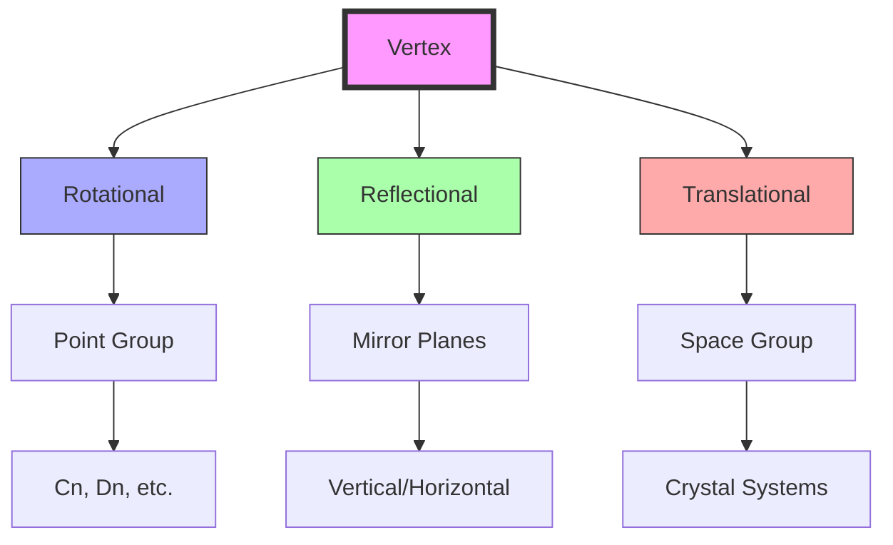
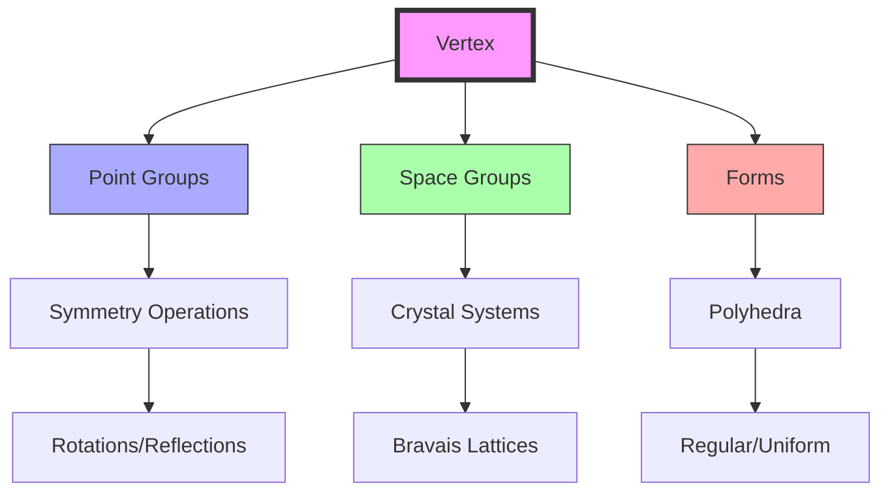
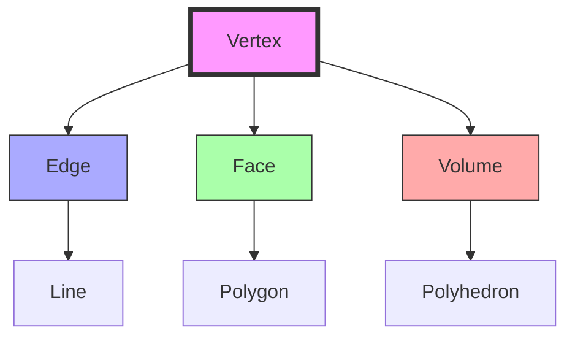
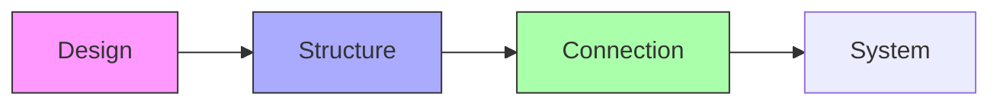
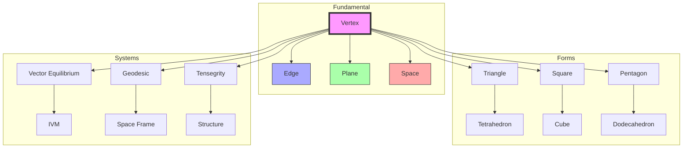
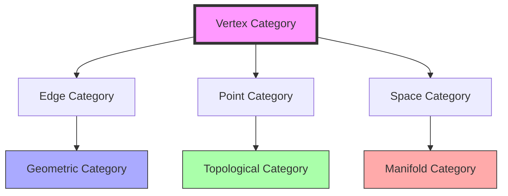

# Vertex

A vertex (plural: vertices) represents a zero-dimensional point where geometric elements meet. In [[concepts/Synergetics_Geometry|Synergetics]], vertices are fundamental to understanding structural systems, from the [[forms/Triangle|triangle]] ([[3]] vertices) to the [[forms/Tetrahedron|tetrahedron]] ([[4]] vertices) and [[concepts/Vector_Equilibrium|Vector Equilibrium]] ([[12]] vertices).

[[Vertex]] is sometimes seen as a Lump, Singularity, Event, Happening, Particle, Blanket, Site, ....

## Topological Properties

### Basic Characteristics
```yaml
properties:
  dimension: 0
  connectivity: variable
  valence: system-dependent
  fundamental: true  # most basic geometric element
```

### System Relationships
1. Regular Polygons
   - [[forms/Triangle|Triangle]]: 3 vertices
   - [[forms/Square|Square]]: 4 vertices
   - Pentagon: 5 vertices
   - Hexagon: 6 vertices

2. Regular Polyhedra
   - [[forms/Tetrahedron|Tetrahedron]]: 4 vertices
   - [[forms/Cube|Cube]]: 8 vertices
   - Octahedron: 6 vertices
   - Icosahedron: 12 vertices
   - Dodecahedron: 20 vertices

## Geometric Hierarchy

### Dimensional Progression
```yaml
hierarchy:
  dimension: 0  # point-like
  generates:
    - [[terms/Edge|Edge]] (1D): Two vertices define an edge
    - [[terms/Plane|Plane]] (2D): Three vertices define a plane
    - [[terms/Space|Space]] (3D): Four vertices define a tetrahedron
  contained_by:
    - [[terms/Edge|Edges]]: As endpoints
    - [[terms/Plane|Planes]]: As corners
    - [[terms/Space|Spaces]]: As points
```

### Vertex Configurations
1. Polygonal Vertices
```yaml
polygon_vertices:
  triangle:
    count: 3
    angle: 60°
    stability: inherent
  square:
    count: 4
    angle: 90°
    stability: requires_bracing
  pentagon:
    count: 5
    angle: 108°
    stability: requires_bracing
```

2. Polyhedral Vertices
```yaml
polyhedron_vertices:
  tetrahedron:
    count: 4
    edges_per_vertex: 3
    faces_per_vertex: 3
    solid_angle: 0.551 steradians
  cube:
    count: 8
    edges_per_vertex: 3
    faces_per_vertex: 3
    solid_angle: 0.524 steradians
  vector_equilibrium:
    count: 12
    edges_per_vertex: 4
    faces_per_vertex: 4
    solid_angle: 0.785 steradians
```

### Vertex Symmetry


## Advanced Properties

### Vertex Coordination
1. Local Structure
```yaml
coordination:
  polygonal:
    minimum: 2  # line endpoint
    triangle: 2  # per vertex
    square: 2  # per vertex
    maximum_planar: 6  # hexagonal
  polyhedral:
    minimum: 3  # tetrahedral
    cube: 3
    octahedral: 4
    icosahedral: 5
    maximum: 12  # vector equilibrium
```

2. Network Properties
```yaml
network:
  connectivity: valence
  degree: edge_count
  centrality: relative_importance
  clustering: local_density
```

### Geometric Transformations
1. Point Group Operations
```yaml
symmetry_operations:
  rotation:
    orders: [2, 3, 4, 6]
    axes: [principal, secondary]
  reflection:
    planes: [vertical, horizontal, diagonal]
  inversion:
    center: origin
    operation: point_reflection
```

2. Space Group Operations
```yaml
crystal_operations:
  translation:
    vectors: [a, b, c]
    periodicity: lattice_dependent
  screw_rotation:
    axes: [21, 31, 41, 61]
    combinations: helical
  glide_reflection:
    planes: [a, b, c, n, d]
    components: [translation + reflection]
```

## Geometric Transformations and Symmetries

### Point Group Operations
1. Symmetry Elements
```yaml
symmetry_elements:
  rotations:
    types: [proper, improper]
    orders: [2, 3, 4, 6]
    notation: Cn, Sn
  reflections:
    types: [mirror, glide]
    planes: [vertical, horizontal, diagonal]
    notation: σv, σh, σd
  inversions:
    center: origin
    operation: -1
    notation: i
```

2. Vertex Orbits
```yaml
orbits:
  tetrahedral:
    order: 12
    positions: 4
    stabilizer: C3
  cubic:
    order: 24
    positions: 8
    stabilizer: C3v
  icosahedral:
    order: 60
    positions: 12
    stabilizer: C5
```

### Crystallographic Operations
1. Space Group Elements
```yaml
space_elements:
  translations:
    vectors: [a, b, c]
    centering: [P, I, F, C]
    notation: t(r)
  screw_axes:
    types: [21, 31, 41, 61]
    direction: [100, 010, 001]
    notation: nm
  glide_planes:
    types: [a, b, c, n, d]
    direction: translation + reflection
    notation: ga, gb, gc
```

2. Site Symmetry
```yaml
site_symmetry:
  special_positions:
    inversion_centers: i
    rotation_axes: n
    mirror_planes: m
  multiplicity:
    general: full_orbit
    special: reduced_orbit
```

### Form Integration


## Advanced Relationships

### Vertex-Form Connections
1. Polygonal Systems
```yaml
polygon_vertices:
  triangle:
    count: 3
    symmetry: D3
    stabilizer: C2
    orbit_structure: [3]
  square:
    count: 4
    symmetry: D4
    stabilizer: C2
    orbit_structure: [4]
  pentagon:
    count: 5
    symmetry: D5
    stabilizer: C1
    orbit_structure: [5]
```

2. Polyhedral Systems
```yaml
polyhedron_vertices:
  tetrahedron:
    count: 4
    symmetry: Td
    stabilizer: C3v
    orbit_structure: [4]
  cube:
    count: 8
    symmetry: Oh
    stabilizer: C3v
    orbit_structure: [8]
  dodecahedron:
    count: 20
    symmetry: Ih
    stabilizer: C3v
    orbit_structure: [20]
```

### Vertex Networks
1. Connection Patterns
```yaml
vertex_networks:
  coordination:
    tetrahedral: [4, 3, 3]  # vertices, edges, faces per vertex
    cubic: [8, 3, 3]
    icosahedral: [12, 5, 5]
  symmetry:
    point_group: rotations + reflections
    space_group: translations + point_group
    site_symmetry: local_environment
```

2. Network Metrics
```yaml
network_metrics:
  degree_distribution:
    minimum: coordination_number
    maximum: valence_limit
    average: total_edges/vertices
  centrality:
    degree: direct_connections
    betweenness: path_control
    eigenvector: influence_measure
```

## Mathematical Structure

### Vertex Properties
1. Coordination Numbers
```yaml
coordination:
  triangle: 2 edges per vertex
  tetrahedron: 3 edges per vertex
  cube: 3 edges per vertex
  vector_equilibrium: 4 edges per vertex
```

2. Angular Relationships
```yaml
angles:
  triangle_vertex: 60°
  square_vertex: 90°
  tetrahedron_vertex: ~70.53°
  cube_vertex: 90°
```

### Vertex Framework


## Synergetic Significance

### System Integration
1. Basic Relationships
   - Defines [[terms/Edge|edges]] endpoints
   - Forms [[terms/Plane|plane]] intersections
   - Creates [[terms/Space|spatial]] nodes
   - Establishes system connections

2. Structural Properties
   - Load transfer points
   - Force distribution nodes
   - System connection points
   - Pattern definition points

### Vertex Organization
```mermaid
mindmap
    root((Vertex))
        Structure
            [[Edge]]
            [[Face]]
            [[Volume]]
        System
            [[Connection]]
            [[Pattern]]
            [[Network]]
```

## Applications

### Structural Uses
1. Engineering Applications
   - Node points in structures
   - Connection vertices
   - System intersections
   - Pattern definition

2. Design Implementation
   - Structural nodes
   - Pattern points
   - System connections
   - Network vertices

### Implementation Framework


## Integration with Forms

### Form Relationships
1. Basic Forms
   - [[forms/Triangle|Triangle]]: 3 vertices defining minimum polygon
   - [[forms/Square|Square]]: 4 vertices requiring stabilization
   - [[forms/Tetrahedron|Tetrahedron]]: 4 vertices defining minimum system
   - [[forms/Cube|Cube]]: 8 vertices in orthogonal system

2. Complex Systems
   - [[concepts/Vector_Equilibrium|Vector Equilibrium]]: 12 vertices in equilibrium
   - [[concepts/Isotropic_Vector_Matrix|IVM]]: Infinite vertex array
   - [[concepts/Geodesic_Mathematics|Geodesic]]: Frequency-based vertices
   - [[concepts/Space_Frames|Space Frame]]: Structural vertex networks

## Mathematical Analysis

### Vertex Calculations
\[
\begin{align*}
V_{polygon} &= n \text{ (number of sides)} \\
V_{polyhedron} &= F + E - 2 \text{ (Euler characteristic)} \\
V_{coordination} &= \frac{2E}{V} \text{ (average per vertex)}
\end{align*}
\]

### System Relationships
```yaml
vertex_counts:
  minimum_polygon: 3  # triangle
  minimum_system: 4  # tetrahedron
  cube_system: 8
  ve_system: 12
```

### Advanced Calculations
1. Vertex Positions in Regular Forms
\[
\begin{align*}
\vec{r}_{tetrahedron} &= \begin{pmatrix} 
\pm 1 & \pm 1 & \pm 1 \\
1 & -1 & -1 \\
-1 & 1 & -1 \\
-1 & -1 & 1
\end{pmatrix} \\
\vec{r}_{cube} &= (\pm 1, \pm 1, \pm 1) \\
\vec{r}_{VE} &= \begin{cases}
(\pm 1, \pm 1, 0) & \text{4 vertices} \\
(\pm 1, 0, \pm 1) & \text{4 vertices} \\
(0, \pm 1, \pm 1) & \text{4 vertices}
\end{cases}
\end{align*}
\]

2. Vertex Angles
\[
\begin{align*}
\theta_{polygon} &= \frac{(n-2)\pi}{n} \\
\theta_{solid} &= 2\pi - \sum_{i=1}^{n} \alpha_i \\
\Omega_{vertex} &= 4\pi - \sum_{i=1}^{n} \omega_i
\end{align*}
\]
where:
- \(\theta_{polygon}\) is the interior angle of a regular n-gon
- \(\theta_{solid}\) is the vertex angle sum
- \(\Omega_{vertex}\) is the solid angle at a vertex
- \(\alpha_i\) are face angles
- \(\omega_i\) are dihedral angles

## Conceptual Integration

### Historical Development
1. Mathematical Origins
```yaml
historical_development:
  ancient:
    greek:
      - Euclid: point definition
      - Archimedes: polyhedra vertices
    indian:
      - Aryabhata: geometric points
      - Brahmagupta: vertex calculations
  modern:
    - [[people/Fuller_Buckminster|R. Buckminster Fuller]]: synergetic vertices
    - [[people/Coxeter_HSM|H.S.M. Coxeter]]: polytope vertices
    - [[people/Edmondson_Amy|Amy Edmondson]]: vertex analysis
```

2. Research Centers
```yaml
research_centers:
  modern:
    - [[organizations/Active_Inference_Institute|Active Inference Institute]]:
        location: [[places/Crescent_City|Crescent City]]
        focus: structural systems
    - [[organizations/Math4Wisdom|Math4Wisdom]]:
        focus: mathematical foundations
        applications: knowledge systems
    - [[organizations/Buckminster_Fuller_Institute|BFI]]:
        focus: design science
        applications: structural systems
```

### System Connections
1. Theoretical Frameworks
```yaml
frameworks:
  geometric:
    - [[concepts/Synergetics_Geometry|Synergetics]]: fundamental system
    - [[concepts/Vector_Equilibrium|Vector Equilibrium]]: 12-vertex system
    - [[concepts/Isotropic_Vector_Matrix|IVM]]: space-filling vertices
  philosophical:
    - [[concepts/Design_Science|Design Science]]: structural principles
    - [[concepts/System_Behavior|System Behavior]]: vertex dynamics
    - [[concepts/Pattern_Recognition|Pattern Recognition]]: vertex patterns
```

2. Practical Applications
```yaml
applications:
  structural:
    - [[concepts/Space_Frames|Space Frames]]: node points
    - [[concepts/Geodesic_Mathematics|Geodesic Systems]]: frequency vertices
    - [[concepts/Tensegrity|Tensegrity]]: vertex forces
  computational:
    - [[concepts/Digital_Mathematics|Digital Mathematics]]: vertex algorithms
    - [[concepts/Pattern_Formation|Pattern Formation]]: vertex emergence
    - [[concepts/System_Analysis|System Analysis]]: vertex networks
```

### Educational Integration
1. Teaching Programs
```yaml
education:
  institutions:
    - [[organizations/Global_University|Global University]]:
        focus: systemic understanding
        methods: practical application
    - [[organizations/Design_Science_Studios|Design Science Studios]]:
        focus: structural design
        methods: hands-on learning
  research:
    - [[organizations/Math4Wisdom|Math4Wisdom]]:
        focus: mathematical principles
        methods: theoretical investigation
```

2. Learning Resources
```yaml
resources:
  publications:
    - [[books/Synergetics|Synergetics]]: comprehensive theory
    - [[books/Synergetics_2|Synergetics 2]]: advanced applications
    - [[papers/Vertex_Analysis|Vertex Analysis]]: technical details
  workshops:
    - [[organizations/Trimtab_Reading_Group|Trimtab Reading Group]]:
        focus: theoretical understanding
        format: collaborative study
```

### Interdisciplinary Connections
1. Scientific Fields
```yaml
scientific_connections:
  physics:
    - quantum_vertices: particle interactions
    - field_theory: vertex operators
    - crystallography: atomic vertices
  biology:
    - molecular_structure: protein vertices
    - cell_geometry: membrane vertices
    - neural_networks: connection points
```

2. Design Applications
```yaml
design_applications:
  architecture:
    - [[concepts/Geodesic_Dome|Geodesic Domes]]: structural nodes
    - [[concepts/Space_Frames|Space Frames]]: connection points
    - [[concepts/Tensegrity|Tensegrity Systems]]: force vertices
  engineering:
    - [[concepts/System_Innovation|System Innovation]]: vertex optimization
    - [[concepts/Pattern_Formation|Pattern Development]]: vertex arrangement
    - [[concepts/System_Analysis|Structural Analysis]]: vertex behavior
```

### Future Developments
1. Research Directions
```yaml
research_areas:
  theoretical:
    - quantum_geometry: vertex operators
    - topological_systems: vertex networks
    - computational_geometry: vertex algorithms
  practical:
    - nano_structures: molecular vertices
    - bio_engineering: cellular vertices
    - smart_materials: adaptive vertices
```

2. Innovation Potential
```yaml
innovations:
  emerging:
    - [[concepts/System_Innovation|System Innovation]]: vertex optimization
    - [[concepts/Pattern_Recognition|Pattern Recognition]]: vertex learning
    - [[concepts/Active_Inference|Active Inference]]: vertex prediction
  applications:
    - [[concepts/Digital_Democracy|Digital Systems]]: network vertices
    - [[concepts/Cognitive_Security|Cognitive Systems]]: information vertices
    - [[concepts/System_Development|System Development]]: growth vertices
```

## Extended Topic Connections

### Knowledge Systems Integration
1. Cognitive Frameworks
```yaml
cognitive_connections:
  pattern_recognition:
    - [[concepts/Pattern_Recognition|Pattern Recognition]]: vertex patterns
    - [[concepts/Active_Inference|Active Inference]]: vertex prediction
    - [[concepts/Cognitive_Security|Cognitive Security]]: information vertices
  learning_systems:
    - [[concepts/Language_of_Wisdom|Language of Wisdom]]: cognitive vertices
    - [[concepts/Wondrous_Wisdom|Wondrous Wisdom]]: knowledge vertices
    - [[concepts/System_Analysis|System Analysis]]: vertex networks
```

2. System Development
```yaml
system_development:
  design_science:
    - [[concepts/Design_Science|Design Science]]: structural vertices
    - [[concepts/System_Innovation|System Innovation]]: vertex optimization
    - [[concepts/System_Behavior|System Behavior]]: vertex dynamics
  pattern_systems:
    - [[concepts/Pattern_Formation|Pattern Formation]]: vertex emergence
    - [[concepts/Dynamic_Patterns|Dynamic Patterns]]: vertex evolution
    - [[concepts/Growth_Patterns|Growth Patterns]]: vertex development
```

### Geometric Network Analysis


### Mathematical Relationships
1. Topological Connections
```yaml
topology:
  vertex_types:
    - [[concepts/Geometric_Topology|Geometric Topology]]: vertex classification
    - [[concepts/Digital_Mathematics|Digital Mathematics]]: vertex computation
    - [[concepts/Quantum_Geometry|Quantum Geometry]]: vertex operators
  networks:
    - [[concepts/Network_Theory|Network Theory]]: vertex connectivity
    - [[concepts/Graph_Theory|Graph Theory]]: vertex degrees
    - [[concepts/Complex_Systems|Complex Systems]]: vertex dynamics
```

2. Structural Analysis
```yaml
structural_analysis:
  methods:
    - [[concepts/Force_Analysis|Force Analysis]]: vertex loads
    - [[concepts/Stability_Analysis|Stability Analysis]]: vertex equilibrium
    - [[concepts/Dynamic_Systems|Dynamic Systems]]: vertex behavior
  applications:
    - [[concepts/Structural_Design|Structural Design]]: vertex placement
    - [[concepts/System_Optimization|System Optimization]]: vertex efficiency
    - [[concepts/Pattern_Integration|Pattern Integration]]: vertex networks
```

### System Applications
```mermaid
mindmap
    root((Vertex Applications))
        Mathematics
            [[Geometric_Topology]]
            [[Digital_Mathematics]]
            [[Network_Theory]]
        Engineering
            [[Structural_Design]]
            [[Force_Analysis]]
            [[System_Optimization]]
        Science
            [[Quantum_Geometry]]
            [[Complex_Systems]]
            [[Dynamic_Systems]]
        Design
            [[Pattern_Integration]]
            [[System_Innovation]]
            [[Growth_Patterns]]
```

### Educational Framework
1. Learning Integration
```yaml
education:
  theoretical:
    - [[concepts/Design_Science_Education|Design Science Education]]: vertex principles
    - [[concepts/Systems_Education|Systems Education]]: vertex networks
    - [[concepts/Pattern_Learning|Pattern Learning]]: vertex recognition
  practical:
    - [[concepts/Hands_On_Learning|Hands-On Learning]]: vertex construction
    - [[concepts/Digital_Learning|Digital Learning]]: vertex modeling
    - [[concepts/Experiential_Education|Experiential Education]]: vertex exploration
```

2. Knowledge Networks
```yaml
knowledge_systems:
  frameworks:
    - [[concepts/Knowledge_Integration|Knowledge Integration]]: vertex connections
    - [[concepts/System_Understanding|System Understanding]]: vertex relationships
    - [[concepts/Pattern_Recognition|Pattern Recognition]]: vertex patterns
  applications:
    - [[concepts/Educational_Design|Educational Design]]: vertex learning
    - [[concepts/System_Teaching|System Teaching]]: vertex instruction
    - [[concepts/Pattern_Education|Pattern Education]]: vertex recognition
```

## Category Theory Integration

### Categorical Structure
1. Vertex Category
```yaml
category_properties:
  objects: vertices
  morphisms: vertex_maps
  composition: path_composition
  identity: self_map
  functor_types:
    - forgetful: to_points
    - free: from_sets
    - representable: vertex_functors
```

2. Universal Properties
```yaml
universal_constructions:
  initial:
    type: source_vertex
    properties: unique_paths
  terminal:
    type: sink_vertex
    properties: convergent_paths
  products:
    type: vertex_products
    construction: fiber_products
```

### Functorial Relationships
1. Geometric Functors
```yaml
geometric_functors:
  vertex_to_edge:
    domain: Vertex
    codomain: Edge
    preservation: incidence
  vertex_to_space:
    domain: Vertex
    codomain: Space
    preservation: position
```

2. Natural Transformations
```yaml
transformations:
  geometric:
    source: position_functor
    target: incidence_functor
    components: vertex_maps
  structural:
    source: vertex_functor
    target: point_functor
    components: structure_maps
```

### Categorical Framework


## Advanced Mathematical Structure

### Categorical Properties
1. Universal Constructions
\[
\begin{align*}
F: \mathbf{Vertex} &\to \mathbf{Top} \\
G: \mathbf{Vertex} &\to \mathbf{Set} \\
H: \mathbf{Vertex} &\to \mathbf{Grph}
\end{align*}
\]

2. Adjoint Relationships
\[
\begin{align*}
F \dashv U &: \mathbf{Top} \to \mathbf{Vertex} \\
G \dashv V &: \mathbf{Set} \to \mathbf{Vertex} \\
H \dashv W &: \mathbf{Grph} \to \mathbf{Vertex}
\end{align*}
\]

### Categorical Diagrams
```yaml
diagrams:
  pullback:
    type: vertex_fiber_product
    universal_property: limit
    construction: categorical_limit
  pushout:
    type: vertex_amalgamation
    universal_property: colimit
    construction: categorical_colimit
```

## References

### Primary Sources
1. [[books/Synergetics|Synergetics]] (Fuller, 1975)
2. [[books/Synergetics_2|Synergetics 2]] (Fuller, 1979)
3. [[papers/Vertex_Analysis|Vertex Analysis]] (Edmondson, 1987)
4. [[papers/System_Geometry|System Geometry]] (Loeb, 1976)

### Related Terms
- [[terms/Edge|Edge]] - Connected by vertices
- [[terms/Plane|Plane]] - Defined by vertices
- [[terms/Space|Space]] - Structured by vertices
- [[terms/Point|Point]] - Geometric equivalent

## Notes
- Most fundamental geometric element
- Defines system connections
- Key to structural stability
- Essential for pattern formation

## Tags
#geometry #topology #synergetics #structure 