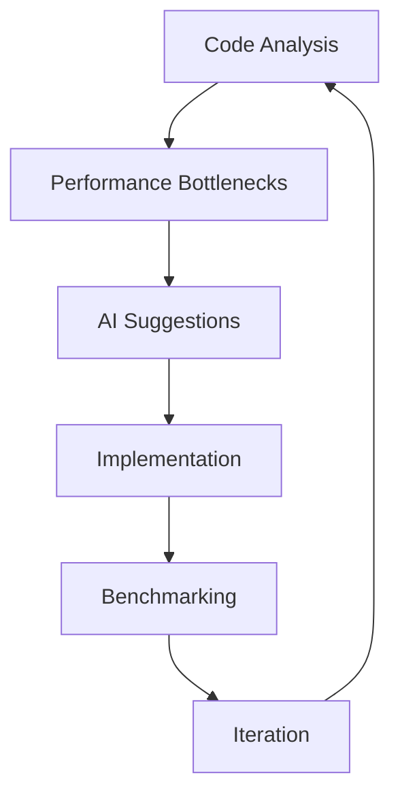
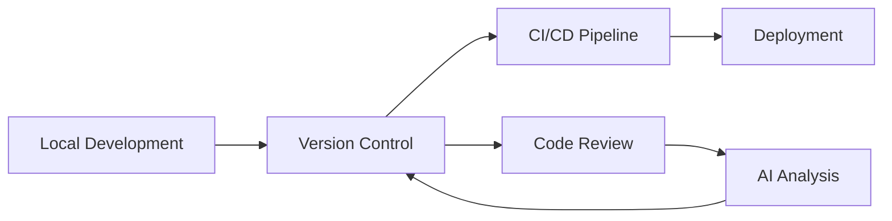

# Cursor

Cursor is an innovative AI-powered code editor designed to enhance programming productivity through intelligent code completion, natural language editing, and deep codebase understanding.

## Overview

Cursor combines traditional code editing capabilities with advanced AI features powered by frontier models. It provides a familiar development environment while introducing powerful AI-assisted coding features that help developers write, edit, and understand code more efficiently.

## Key Features

### AI Code Assistance
- Intelligent code completion
- Natural language code editing
- Context-aware suggestions
- Multi-line code predictions
- Automated refactoring suggestions

### Codebase Understanding
- Semantic code search
- Deep code analysis
- Documentation generation
- Context-aware answers
- Reference finding

### Development Environment
- Extension compatibility
- Theme support
- Keybinding customization
- Git integration
- Terminal integration

## Technical Capabilities

### AI Integration
- Multiple AI model support
- Purpose-built models
- Frontier model access
- Privacy-focused processing
- Secure data handling

### Performance
- Fast code analysis
- Real-time suggestions
- Efficient resource usage
- Background processing
- Responsive interface

### Privacy and Security
- SOC 2 certification
- Privacy mode option
- Local processing options
- Secure data transmission
- Configurable data sharing

## Use Cases

### Code Development
- Rapid prototyping
- Code maintenance
- Refactoring projects
- Bug fixing
- Feature implementation

### Documentation
- Code documentation
- README generation
- API documentation
- Comment generation
- Usage examples

### Learning
- Code explanation
- Best practices guidance
- Pattern recognition
- Error understanding
- Framework learning

## Benefits

### Productivity
- Faster code writing
- Reduced repetition
- Automated tasks
- Streamlined workflows
- Enhanced focus

### Quality
- Consistent code style
- Error prevention
- Best practice adherence
- Improved documentation
- Better maintainability

### Learning
- Skill development
- Pattern recognition
- Best practice exposure
- Framework understanding
- Technology exploration

## Integration

### Development Tools
- Version control systems
- Build tools
- Testing frameworks
- Debugging tools
- Package managers

### Workflows
- CI/CD pipelines
- Code review processes
- Documentation workflows
- Testing procedures
- Deployment systems

## Best Practices

### Setup
- Environment configuration
- Extension management
- Privacy settings
- Keybinding customization
- Theme selection

### Usage
- AI prompt optimization
- Code organization
- Documentation habits
- Version control
- Testing integration

## Advanced AI Capabilities

### Agentic Features
- Autonomous code generation
- Context-aware refactoring
- Intelligent error detection
- Proactive suggestions
- Adaptive learning

### AI Pair Programming
- Real-time collaboration
- Code review assistance
- Architecture suggestions
- Pattern recognition
- Learning from corrections

### Advanced Prompting

## Advanced Usage Techniques

### AI-Assisted Workflows
- Test-driven development with AI
- Documentation-first approach
- Automated code review
- Intelligent refactoring
- Pattern-based development

### Code Architecture
- System design assistance
- Component relationships
- Dependency management
- Architecture patterns
- Scalability planning

### Performance Optimization


## Power User Tips

### Keyboard Shortcuts
```markdown
| Action | Windows/Linux | macOS |
|--------|--------------|--------|
| AI Complete | Tab | Tab |
| Command Palette | Ctrl+Shift+P | Cmd+Shift+P |
| Quick Fix | Ctrl+. | Cmd+. |
| Search Codebase | Ctrl+Shift+F | Cmd+Shift+F |
| AI Inline | Alt+/ | Option+/ |
```

### Context Management
- Project-specific settings
- Language-specific prompts
- Framework-aware suggestions
- Environment configuration
- Custom AI behaviors

### Advanced Integration


## Troubleshooting

### Common Issues
- Model context limitations
- Response accuracy
- Performance optimization
- Integration conflicts
- Security considerations

### Solutions
- Context window management
- Prompt refinement
- Cache optimization
- Integration debugging
- Security configuration

## Expert Workflows

### Code Generation
```markdown
1. System Design
   - Architecture planning
   - Component specification
   - Interface definition

2. Implementation
   - AI-assisted coding
   - Test generation
   - Documentation

3. Refinement
   - Code review
   - Optimization
   - Security analysis
```

### Project Management
- Task breakdown
- Timeline estimation
- Resource allocation
- Progress tracking
- Quality assurance

## References

- [Cursor Official Website](https://cursor.com)
- [[LLM]] - Large Language Models
- [[Development_Tools]]
- [[AI_Programming_Assistants]]
