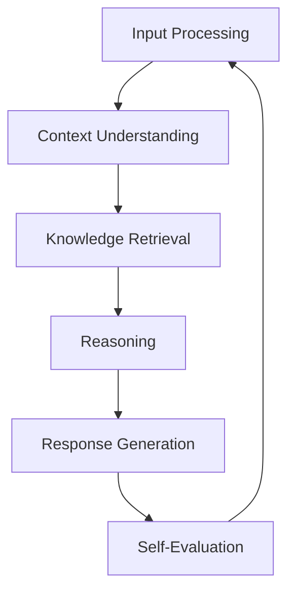
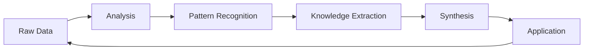
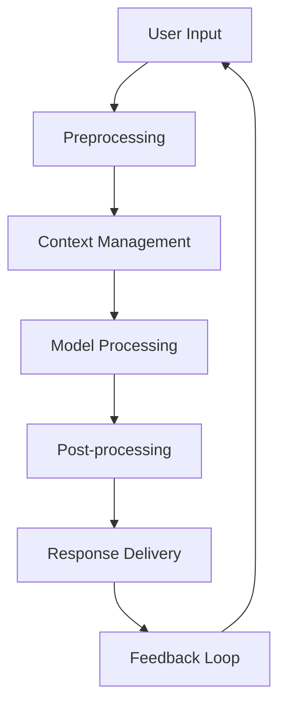
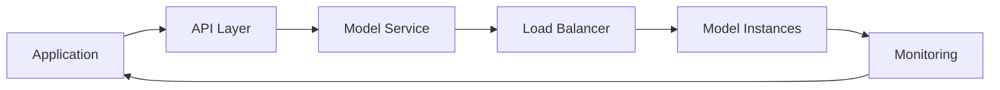

# Large Language Models (LLMs)

Large Language Models (LLMs) are advanced artificial intelligence systems trained on vast amounts of text data to understand, generate, and manipulate human language in sophisticated ways.

## Overview

LLMs represent a breakthrough in natural language processing, capable of understanding context, generating coherent text, and performing complex language-based tasks. These models use transformer architectures and are trained on massive datasets to develop deep language understanding capabilities.

## Key Characteristics

### Architecture
- Transformer-based design
- Attention mechanisms
- Deep neural networks
- Parallel processing
- Scalable architecture

### Capabilities
- Text generation
- Language understanding
- Context awareness
- Pattern recognition
- Task adaptation

### Training
- Large-scale datasets
- Unsupervised learning
- Fine-tuning options
- Transfer learning
- Continuous training

## Applications

### Development
- Code generation
- Documentation writing
- Bug detection
- Code explanation
- Refactoring assistance

### Content Creation
- Text generation
- Content summarization
- Translation
- Editing assistance
- Style adaptation

### Analysis
- Text analysis
- Sentiment detection
- Topic modeling
- Pattern identification
- Trend analysis

## Technical Details

### Model Types
- GPT series
- BERT variants
- T5 models
- PaLM models
- Claude series

### Components
- Tokenization
- Embedding layers
- Attention mechanisms
- Feed-forward networks
- Output layers

### Training Process
- Pre-training
- Fine-tuning
- Prompt engineering
- Parameter optimization
- Model evaluation

## Implementation

### Integration Methods
- API access
- Local deployment
- Cloud services
- Custom solutions
- Hybrid approaches

### Resource Requirements
- Computing power
- Memory allocation
- Storage capacity
- Network bandwidth
- API quotas

## Best Practices

### Usage Guidelines
- Prompt engineering
- Context management
- Output validation
- Error handling
- Resource optimization

### Ethical Considerations
- Bias awareness
- Privacy protection
- Content filtering
- Usage transparency
- Impact assessment

## Limitations

### Current Challenges
- Hallucination issues
- Context limitations
- Resource intensity
- Cost considerations
- Bias presence

### Mitigation Strategies
- Output verification
- Context enhancement
- Resource optimization
- Cost management
- Bias reduction

## Future Developments

### Research Areas
- Efficiency improvements
- Capability expansion
- Resource optimization
- Ethical frameworks
- Integration methods

### Potential Advances
- Reduced resource needs
- Enhanced accuracy
- Broader capabilities
- Better understanding
- Improved efficiency

## Advanced Capabilities

### Agentic Behaviors
- Task decomposition
- Self-improvement
- Meta-learning
- Chain-of-thought reasoning
- Tool utilization

### Cognitive Architecture


### Advanced Prompting Techniques
```markdown
# Structured Prompting Patterns

1. Chain of Thought:
   ```
   Let's approach this step by step:
   1. First, we need to...
   2. Then, considering...
   3. Finally, we can...
   ```

2. Role-Based:
   ```
   Act as a [role] with expertise in [domain].
   Your task is to [objective].
   ```

3. Few-Shot Learning:
   ```
   Example 1: Input -> Output
   Example 2: Input -> Output
   Now: New Input -> ?
   ```
```

## Advanced Applications

### System Design
- Architecture planning
- Component specification
- Interface design
- Pattern recognition
- Optimization strategies

### Knowledge Synthesis


### Tool Integration
- API orchestration
- Workflow automation
- System coordination
- Error handling
- Performance optimization

## Expert Usage

### Context Window Management
```markdown
| Technique | Purpose | Example |
|-----------|---------|---------|
| Chunking | Break large inputs | Split documents |
| Summarization | Compress information | Key points |
| Threading | Maintain context | Conversation chain |
| Memory | Store key info | Important facts |
```

### Response Optimization
- Temperature control
- Sampling strategies
- Token optimization
- Response formatting
- Error recovery

### Advanced Integration Patterns


## Performance Optimization

### Model Selection
- Task requirements
- Performance metrics
- Resource constraints
- Cost considerations
- Quality requirements

### Resource Management
```markdown
# Optimization Strategies

1. Caching
   - Response caching
   - Context caching
   - Embedding storage

2. Batching
   - Request batching
   - Pipeline optimization
   - Parallel processing

3. Fine-tuning
   - Task-specific training
   - Domain adaptation
   - Performance tuning
```

## Advanced Development

### Custom Solutions
- Model fine-tuning
- Domain adaptation
- Custom architectures
- Specialized pipelines
- Performance optimization

### Integration Architecture


## References

- [[Cursor]] - AI-powered code editor
- [[AI_Programming_Assistants]]
- [[Natural_Language_Processing]]
- [[Machine_Learning]]
