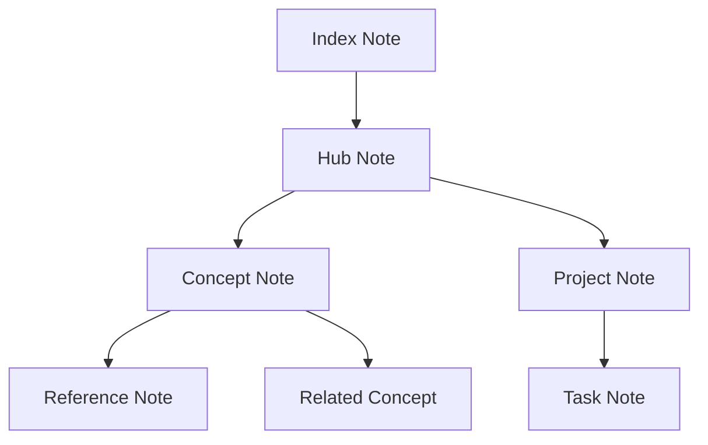
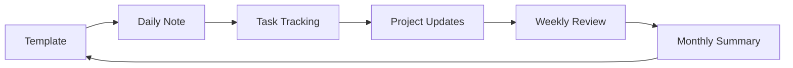
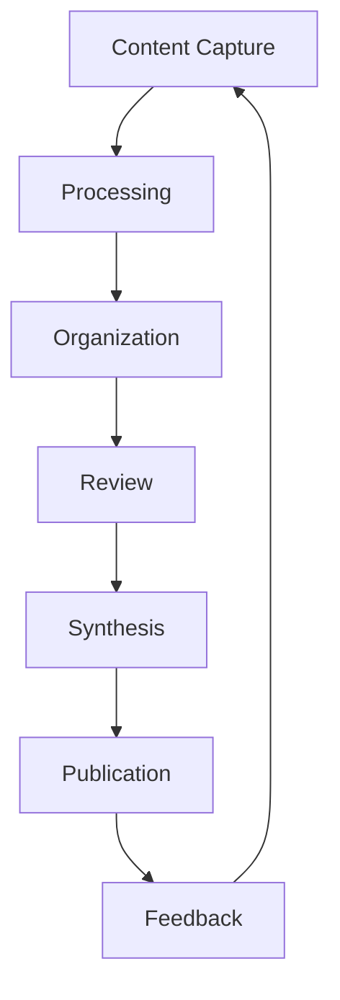

# Obsidian

Obsidian is a powerful knowledge management application that enables users to create and maintain a personal knowledge base using markdown files and bidirectional linking.

## Overview

Obsidian provides a modern approach to note-taking and knowledge management, emphasizing local storage, markdown formatting, and interconnected thinking through its unique linking capabilities and graph visualization.

## Key Features

### Note Management
- Markdown support
- Bidirectional linking
- File attachments
- Tags and metadata
- Custom templates

### Knowledge Graph
- Visual representation
- Relationship mapping
- Network analysis
- Connection discovery
- Pattern visualization

### Customization
- Custom CSS
- Plugin system
- Themes
- Hotkey configuration
- Workspace layouts

## Core Concepts

### Vault Structure
- Local storage
- Folder organization
- File hierarchy
- Attachment management
- Version control compatibility

### Linking System
- Wiki-style links
- Backlinks
- Transclusion
- Embedded content
- External links

### Markdown Enhancement
- Extended syntax
- Custom callouts
- Code blocks
- Math notation
- Diagrams

## Use Cases

### Personal Knowledge Management
- Note-taking
- Research organization
- Project planning
- Task management
- Reference collection

### Academic Work
- Research notes
- Literature reviews
- Paper writing
- Citation management
- Study organization

### Professional Use
- Documentation
- Project management
- Client notes
- Meeting minutes
- Process documentation

## Features

### Core Functionality
- Editor
- Preview mode
- File explorer
- Search
- Quick switcher

### Advanced Features
- Graph view
- Command palette
- Daily notes
- Templates
- Workspaces

### Community Plugins
- Third-party extensions
- Custom functionality
- Integration options
- Workflow enhancement
- Automation tools

## Best Practices

### Organization
- Folder structure
- Naming conventions
- Tag systems
- Link management
- Template usage

### Workflow
- Daily notes
- Weekly reviews
- Project organization
- Reference management
- Knowledge linking

## Integration

### Tools
- Version control
- Cloud sync
- Mobile apps
- Publishing options
- Export formats

### Workflows
- Research
- Writing
- Project management
- Study
- Documentation

## Security

### Data Protection
- Local storage
- Encryption options
- Backup strategies
- Sync security
- Access control

### Privacy
- Offline capability
- Data ownership
- Controlled sharing
- Personal vault
- Selective sync

## Advanced Knowledge Management

### Zettelkasten Method
```markdown
# Zettelkasten Implementation

1. Atomic Notes
   - Single concept per note
   - Clear title
   - Unique identifier

2. Connections
   - Bidirectional links
   - Context links
   - Hub notes

3. Structure
   - Index notes
   - Map of content
   - Project notes
```

### Advanced Linking


### Knowledge Graphs
- Cluster analysis
- Path finding
- Connection discovery
- Pattern visualization
- Knowledge mapping

## Advanced Workflows

### PARA Method
```markdown
# Organization Structure

1. Projects
   - Active initiatives
   - Current goals
   - Ongoing work

2. Areas
   - Life domains
   - Responsibilities
   - Ongoing interests

3. Resources
   - Topic references
   - Knowledge base
   - Archive material

4. Archives
   - Completed projects
   - Reference material
   - Historical notes
```

### Advanced Templates
```javascript
---
created: {{date}}
type: {{type}}
status: {{status}}
tags: {{tags}}
---

# {{title}}

## Overview
{{overview}}

## Key Points
- {{point1}}
- {{point2}}
- {{point3}}

## References
- {{ref1}}
- {{ref2}}
```

### Query System
```dataview
TABLE
  file.ctime as Created,
  status as Status,
  priority as Priority
FROM #projects
WHERE status != "completed"
SORT priority DESC
```

## Power Features

### Advanced Plugins
- Dataview queries
- Templater scripts
- Calendar integration
- Task management
- Spaced repetition

### Custom Styling
```css
.custom-class {
  font-family: 'Custom Font';
  color: #custom-color;
  padding: 10px;
  margin: 5px;
  border-radius: 5px;
}

.callout {
  background: #f5f5f5;
  border-left: 4px solid #007acc;
}
```

### Automation


## Expert Techniques

### Knowledge Processing
```markdown
# Information Flow

1. Capture
   - Quick notes
   - Web clipper
   - Mobile capture

2. Process
   - Categorization
   - Linking
   - Summarization

3. Organize
   - Folder structure
   - Tagging system
   - Cross-referencing

4. Review
   - Weekly review
   - Monthly summary
   - Quarterly cleanup
```

### Advanced Search
- Regular expressions
- Tag combinations
- Metadata filters
- Full-text search
- Link analysis

### Integration Patterns


## System Optimization

### Performance
- Vault optimization
- Cache management
- Search indexing
- Plugin efficiency
- Sync optimization

### Backup Strategy
```markdown
# Backup Layers

1. Local
   - File system backup
   - Version control

2. Cloud
   - Sync service
   - Cloud backup

3. Archive
   - Periodic snapshots
   - Long-term storage
```

## References

- [Obsidian Official Website](https://obsidian.md)
- [[Knowledge_Management]]
- [[Note_Taking_Tools]]
- [[Personal_Knowledge_Management]]
